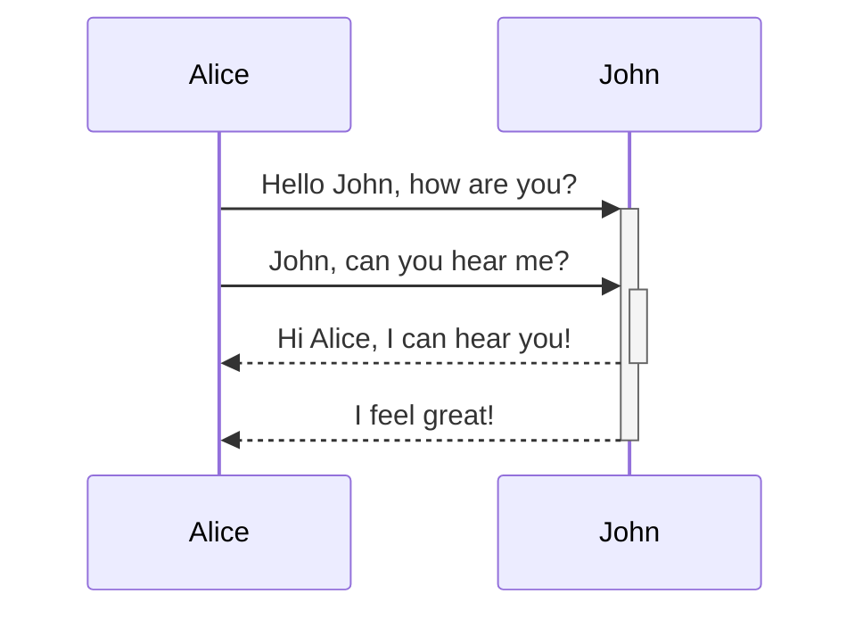

# Карта Знаний

## Архитектура

- Ядро Карты Знаний
  - Постановка цели
  - Генерация нового знания к конкретной цели
  - Обратное планирование от цели. Декомпозиция
  - Получение вложенности одного в другое
  - Обнаружение опровержений
  - Обнаружение противоречий
  - Разрешение противоречий
- Укладка графа
- NLP
  - Получение сущностей из текстов (NER)
  - Получение цепочек действий из текстов
  - Получение зависимостей паттернов действий друг от друга
  - Получение зависимостей успешных паттернов действий друг от друга
- Клиенты
  - Браузерный
  - Программный
    - Python
- Хранилище
  - S3
- Базы данных
  - Neo4j
- Загрузчики данных
  - PubMed baseline
  - PubMed Central
- Исследования
  - Успешные паттерны зависимости действий друг от друг
  - Обнаружение "Таблицы Менделеева" для знаний. Атомарных единиц знаний вроде грамем
  - Уникальность знания
  - Предсказательная сила Карты Знаний

## Стек

Микросервисная архитектура

## Запуск

## Взаимодействие между сервисами

Пример встроенной диаграммы последовательности. Так же можно сохранять в отдельном файле с расширением Mermaid `.mmd`.

