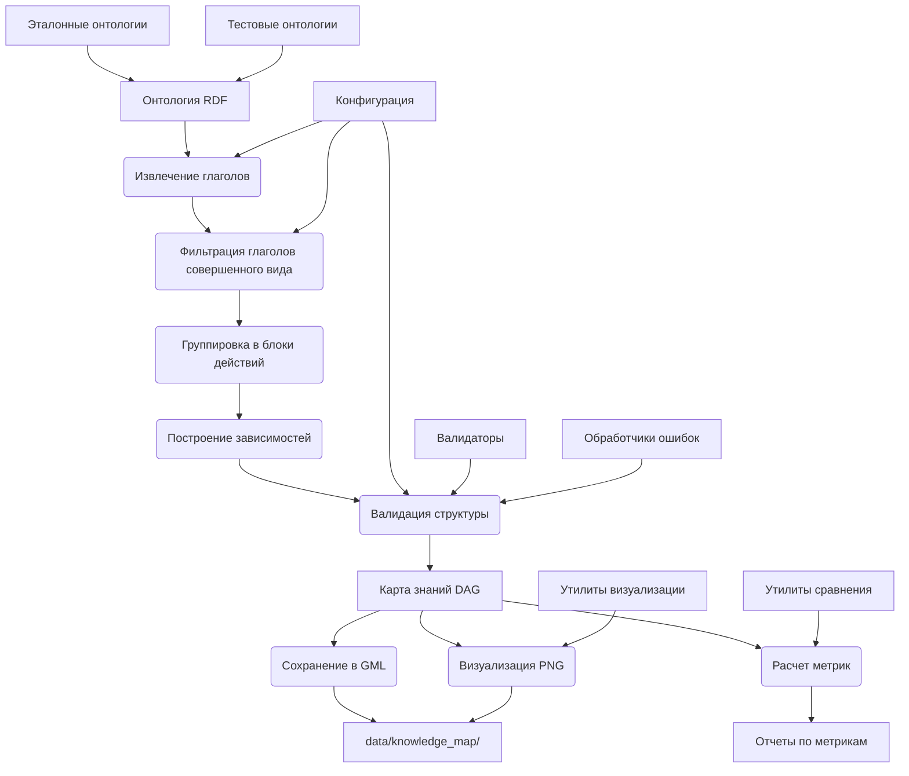

# Архитектурная диаграмма преобразования онтологий в карты знаний

## Компоненты системы

### 1. Входные данные
- **Онтология RDF**: Исходная онтология в формате RDF
- **Эталонные онтологии**: Тестовые онтологии из `nlp/src/ontology/reference/ontologies.py`
- **Тестовые онтологии**: Онтологии из `data/nlp/`

### 2. Основные компоненты

#### 2.1 Извлечение глаголов
- Анализ RDF графа
- Идентификация глагольных концептов
- Извлечение лингвистических свойств

#### 2.2 Фильтрация глаголов
- Проверка формы глагола (совершенный вид)
- Фильтрация по семантическим критериям
- Группировка по субъектам

#### 2.3 Группировка в блоки
- Создание блоков действий
- Ограничение 1-2 глаголами на блок
- Извлечение связанных объектов

#### 2.4 Построение зависимостей
- Анализ семантических связей
- Создание направленных ребер
- Проверка уникальности связей

#### 2.5 Валидация структуры
- Проверка DAG (направленный ациклический граф)
- Проверка количества глаголов в блоках
- Проверка формы глаголов

### 3. Выходные данные

#### 3.1 Карта знаний
- NetworkX DiGraph
- Узлы: блоки действий
- Ребра: зависимости между действиями

#### 3.2 Файлы вывода
- **GML файлы**: Структура графа
- **PNG изображения**: Визуализация графа
- **Метрики**: Отчеты по качеству

### 4. Вспомогательные компоненты

#### 4.1 Утилиты сравнения
- Расчет Precision, Recall, F1-Score
- Сравнение узлов и ребер
- Генерация статистики

#### 4.2 Утилиты визуализации
- Создание изображений графов
- Раскраска узлов и ребер
- Легенды и аннотации

#### 4.3 Конфигурация
- Параметры преобразования
- Правила валидации
- Форматы вывода

#### 4.4 Валидаторы
- Проверка структуры графа
- Проверка семантики блоков
- Проверка связей

#### 4.5 Обработчики ошибок
- Обработка некорректных глаголов
- Обработка циклов в графе
- Обработка дублирующихся связей

## Поток данных

1. **Вход**: RDF онтология
2. **Обработка**: 
   - Извлечение глаголов → Фильтрация → Группировка → Зависимости → Валидация
3. **Выход**: Карта знаний + метрики + визуализации

## Интеграция с существующими компонентами

- **Онтологии**: `nlp/src/ontology/reference/ontologies.py`
- **Сравнение**: `nlp/src/ontology/comparison/graph_comparison.py`
- **Визуализация**: `nlp/src/ontology/visualization/graph_viz.py`
- **Конфигурация**: `nlp/src/ontology/config/domain_config.json`