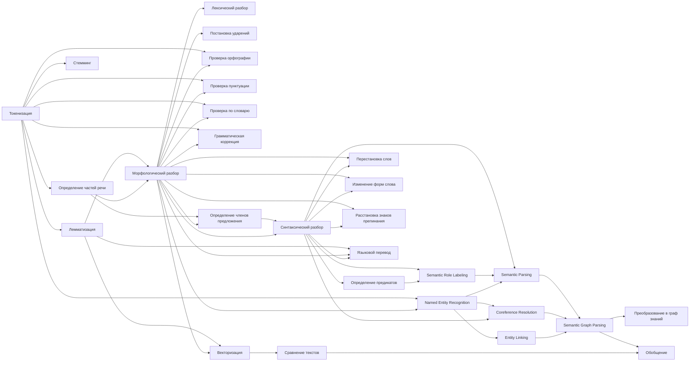

# Карта Знаний. Лингвистика

## Источники

- Русский язык. 2012 год. Теория. 5-9 классы. Бабайцева. Чеснокова
- [A Comparison of Lexical Tokenization Methods](https://ideaexchange.uakron.edu/cgi/viewcontent.cgi?article=3344&context=honors_research_projects)

## Идеи

- Слова содержащиеся в тексте повод подумать о наличии **Связи** которую нужно вытащить из текста: для
- Использовать одну из метрик для проверки похожести текстов — мешок слов. Использовать даже при наличии более подходящих метрик.
- Использовать UD формат и SRL‑модуль.

## Цель

Целевая форма: [глагол]-[объект❓]-[субъект❓]
Формулировка задачи: Seq2Graph — преобразование произвольного текста в семантический граф знаний. NER, Извлечение фактов/отношений (Relation Extraction), Coreference Resolution → слияние узлов, Entity Linking → выравнивание узлов по онтологиям, Semantic Parsing, Semantic Graph Parsing

❌ — сложная задача, её нужно пропустить, к ней лучше подступаться позже

- Записываем сюда все возможные операции над текстом в порядке их применения. Грамемы
  1. ❌ (на 2025.07.04) Этимология слова (история, словообразование)
  2. ❌ (на 2025.07.04) Морфемный разбор (разбор слова по составу, морфемика)
    - Основа слова
      - Приставка (Префикс)
      - Корень
      - Суффикс
    - Аффиксы
      - Префикс (Приставка)
      - Суффикс
      - Окончание
      - Постфикс
  3. Сегментация — разделение текста на логические единицы (сегменты) на разных уровнях лингвистического анализа
     - Токенизация (Tokenization)
     - Сегментация предложений (Sentence Segmentation)
     - Сегментация абзацев
     - Сегментация документов
     - Морфологическая
     - Семантическая
     - Диалоговая
  4. Токенизация (❗ Нужно выбрать токинезациию соответствующую итоговой метрике той конечной задачи которую мы решаем)
    - White Space. Деление предложения на слова по пробелам
    - Word
    - Sentence
    - Character
    - N-gram
    - Regular Expression
    - Penn Treebank
    - Subword
    - Byte Pair Encoding (BPE)
    - WordPiece
  - Лемматизация
    - Стеминг
  - Разбор предложения
    - Определение частей речи
      - Глагол
        - Вид
          - Совершённый
          - Не совершённый
        - ❓
          - Инфинитив
        - ❓Аргументы (как предиката)
          - Транзитивность
          - Интранзитивность
          - Сериальные конструкции
          - ❓
        - ❓
          - Телиситет (telicity) (способность глагола обозначать завершённое действие)
        - Согласованность
          - По лицу
          - По числу
      - Наречие
      - Существительное
        - Изменяется по
          - Падеж
          - Число
          - Род
          - Склонение
      - Прилагательное
      - Местоимение
      - Союз
      - Частица
      - Предлог
      - Числительное
      - Причастие
      - Деепричастие
      - Междометие
      - Артикль (только в английском, служебная часть речи)
        - Определённый
        - Неопределённый
        - Нулевой
        - Частичного количества. Частичный. Партитивный артикль
    - Определение членов предложения
      - Подлежащее
      - Сказуемое
        - Составное глагольное
      - Дополнение
      - Обстоятельство
      - Определение
      - ❓
    - Характеристика предложения
      - По цели высказывания
        - Повествовательное
        - Вопросительное
        - Побудительное
      - По интонации
        - Невосклецательное
      - По сложности
        - Простое
        - Сложное
      - По наличию главных членов
        - Односоставное
      - По наличию второстепенных членов
        - Распространённое
      - По осложнённости
        - Не осложнено обращениями
        - Не осложнено вводными словами
        - Не осложнено однородными членами
  - Проверка на ошибки
    - По правилам языка
    - По словарю
    - Пуктуация
    - Орфография
  - ❓ Определение номенативности языка
  - Определение лексем
  - Постановка ударений
  - Лексический разбор ❓
  - Морфологический разбор ❓
  - Грамматический разбор ❓
  - Синтаксический разбор ❓
  - Лексический разбор ❓
  - Определение наклонения
    - Изъявительное
    - Повелительное
    - Сослагательное
  - Удаление оценочных суждений или преобразование в предполагаемые
  - Изменение форм слова
  - Поиск однокоренных
  - Поиск синонимов
  - Поиск антонимов
  - Порядок слов
  - Определение полярности
    - Утвердительное
    - Отрицательное
  - Определение одушевлённости
  - Определение счётности
  - Определение падежа
  - Определение времени
  - Определение рода
    - Мужской
    - Женский
    - Средний
  - Определение лица
  - Определение числа
  - Определение склонения
  - Определение спряжения
  - Определение краткости
  - Определение степени
  - Определение залога
    - Действительный. Активный. Актив. Прямой в номинативных языках
    - Страдательный. Пассивный. Пассив. Косвенный в номинативных языках
    - Рефлексив. Возвратный
    - Реципрок. Взаимный
    - Медий. Средний
    - Антипассив. Косвенный
    - Эргативный. Эргативная конструкция. Прямой в эргативных языках
    - Имперсонал. Безличный залог
    - Каузатив. Причинительный. Понудительный залог
  - Расстановка знаков препинания
  - Перестановка слов (но лучше найти вариации семантического графа так как их меньше из-за отсутствия зависимости от некоторых перестановок)
    - С сохранением смысла
    - Без сохранения смысла, но сохранением валидности грамматики
    - Без сохранения смысла и валидности грамматики
  - Преобразование в граф
  - Векторизация
  - Сравнение
    - Мешок слов
    - Косинусное расстояние
    - ❓
  - Обобщение
  - Языковой перевод

- Все библиотеки для NLP
  - spaCy
  - nltk
  - gensim
  - deeppavlov
  - natasha
  - pymorphy
  - UDPipe
  - pymystem3
  - PyDictionary

([Тут должны быть все грамемы](https://universaldependencies.org/u/feat/all.html))

Обозначения в библиотеках
| Часть речи             | Part of Speech            | spaCy | pymorphy2                             |
| ---------------------- | ------------------------- | ----- | ------------------------------------- |
| существительное        | noun                      | NOUN  | NOUN                                  |
| имя числительное       | numeral                   | NUM   | NUMR                                  |
| имя собственное        | proper noun               | PROPN |                                       |
| местоимение            | pronoun                   | PRON  | NPRO                                  |
| прилагательное         | adjective                 | ADJ   | ADJF (полное), ADJS (краткое)         |
| глагол                 | verb                      | VERB  | VERB (личная форма), INFN (инфинитив) |
| вспомогательный глагол | auxiliary                 | AUX   |                                       |
| наречие                | adverb                    | ADV   | ADVB                                  |
| ?расположение          | adposition                | ADP   |                                       |
| ?согласованный союз    | coordinating conjunction  | CCONJ |                                       |
| ?союз                  | conjunction               |       | CONJ                                  |
| ?определитель          | determiner                | DET   |                                       |
| междометие             | interjection              | INTJ  | INTJ                                  |
| частица                | particle                  | PART  | PRCL                                  |
| ?подчинительный союз   | subordinating conjunction | SCONJ |                                       |
| символ                 | symbol                    | SYM   |                                       |
| пунктуация             | punctuation               | PUNCT |                                       |
| компаратив             | —                         | PUNCT | COMP                                  |
| причастие (полное)     | —                         | PRTF  |                                       |
| причастие (краткое)    | —                         | PRTS  |                                       |
| деепричастие           | —                         | GRND  |                                       |
| предикатив             | —                         | PRED  |                                       |
| предлог                | —                         | PREP  |                                       |

| Падеж                          | Case | spaCy | pymorphy2 |
| ------------------------------ | ---- | ----- | --------- |
| именительный                   |      |       | nomn      |
| родительный                    |      |       | gent      |
| дательный                      |      |       | datv      |
| винительный                    |      |       | accs      |
| творительный                   |      |       | ablt      |
| предложный                     |      |       | loct      |
| звательный                     |      |       | voct      |
| второй родительный (частичный) |      |       | gen2      |
| второй винительный             |      |       | acc2      |
| второй предложный (местный)    |      |       | loc2      |

| Число               | Case | spaCy | pymorphy2 |
| ------------------- | ---- | ----- | --------- |
| единственное число  |      |       | sing      |
| множественное число |      |       | plur      |

- Это уже другой пайпланйн — для алгоритмов Карты Знаний, не делать в лингвистике, убрать из лингвистики
  - Определение предикатов
  - Проверка на логику

## 
##
##

##  
## 
## 
## 
## 
## 
## 
## 
## 
## 
## 
## 
## 
## 
## 
## 
## 
## 

========================================

Хорошо, я соберу полный список всех грамем английского языка — включая морфологические, синтаксические, семантические и прагматические категории. Также уточню возможные региональные различия (британский и американский варианты) и особенности классификации.
Я сообщу, когда исследование будет готово.

# Грамматические категории английского языка (грамемы)

## Морфологические категории

* **Число (Number)** – две значения: единственное (*singular*) и множественное (*plural*). У существительных множественное число образуется обычно добавлением -s (например, **book – books**), причём есть нерегулярные формы (*man – men, child – children*). Местоимения и глаголы также различаются по числу: в третьем лице ед.ч. настоящего времени глагол получает окончание -s (he *walks*). Категория обязательна для существительных, местоимений и проявляется в согласовании глагола с подлежащим.
* **Падеж (Case)** – отмечается у местоимений (три значения: именительный/subjective, винительный/objective, притяжательный/possessive) и частично у существительных (притяжательный). Например, личное местоимение 1-го лица единственного числа: **I (nom.) – me (acc.) – my (poss.)**. Существительные имеют possessive-падеж с суффиксом -'s (*the cat’s toy*). Именительный/винительный падеж существительных (роль подлежащего/дополнения) не маркируется формально.
* **Род (Gender)** – в современном английском грамматический род существительных отсутствует; сохраняется лишь естественный (natural) род в системе местоимений. Так, местоимения *he/him/his* – мужского рода, *she/her/hers* – женского, *it/it/its* – среднего (для предметов, животных без обозначения пола). Архаичные формы типа *actor/actress* или местоимения *thou/thee* соответственно устарели.
* **Лицо (Person)** – категория местоимений: первое (I, we), второе (you) и третье (he, she, it, they). Например, *I* – 1-е лицо ед.ч., *we* – 1-е мн.ч., *you* – 2-е (ед. и мн.), *he/she/it*, *they* – 3-е. Местоимения и спрягаемые глаголы согласуются по лицу (см. окончание -s в he **walks**).
* **Время (Tense)** – простые формы времён: **present** и **past** (настоящее и прошедшее). Например: *I **work*** (present), *I **worked*** (past). Формы будущего времени в английском не кодируются отдельной формой глагола: будущее выражается модальным *will* или конструкцией *be going to*, поэтому «future tense» не считается собственным морфологическим временем.
* **Вид (Aspect)** – передаёт вид действия: **simple** (действие без структуры во времени), **continuous/progressive** (продолженное), **perfect** (завершённое). Например: *he **writes*** (simple), *he **is writing*** (continuous), *he **has written*** (perfect), *he **has been writing*** (perfect continuous). Комбинация этих значений («perfect progressive» и др.) образуется аналитически (с вспомогательными глаголами).
* **Наклонение (Mood)** – **indicative** (изъявительное), **imperative** (повелительное), **subjunctive** (сослагательное). Например: *He writes* (indicative), *Write!* (imperative, подразумевается “you write”), *I demand that he **write*** (subjunctive: *write* без -s после that). Изъявительное – основное наклонение; повелительное используется для команд. Сослагательное используется редко и преимущественно в формальных конструкциях (*It is essential that she be present*).
* **Залог (Voice)** – два значения: **active** (действительный) и **passive** (страдательный). Активный залог: подлежащее выполняет действие (*The cat ate the mouse*). Пассивный: подлежащее подвергается действию (*The mouse was eaten by the cat*). Пассивный залог образуется сочетанием *be* + причастие прошедшего времени.
* **Степень (Degree)** – для качественных прилагательных и наречий: **positive** (положительная), **comparative** (сравнительная), **superlative** (превосходная). Например: *big – bigger – biggest*, *carefully – more carefully – most carefully*. Имеются и неправильные формы (*good – better – best*). Сравнительная степень может выражаться и при помощи *more/most* (особенно с длинными прилагательными).

## Синтаксические категории

* **Типы предложений (Sentence types)** – по цели высказывания: **декларативные** (утвердительные), **вопросительные** (общие/специальные вопросы), **императивные** (повелительные) и **восклицательные**. Например: *It is raining.* (декларативное); *Is it raining?* (вопросительное); *Open the window.* (императив); *What a beautiful day!* (восклицательное). Каждый тип имеет характерный синтаксический строй: порядок слов, наличие вспомогательных глаголов do/does, интонацию и т. д. В повествовательном и вопросительном предложении подлежащее обычно выражается местоимением или существительным (кроме безличных конструкций).
* **Предложение** – основная синтаксическая единица: простое или сложное, главное и придаточное. Грамматические категории наклонения и залога уже включают синтаксическую информацию (см. раздел «Наклонение»). Например, придаточные изъяснительные часто вводятся союзами *that, if, whether* и пр. (не «грамемы» в узком смысле, но отражают синтаксическую структуру).
* **Порядок слов** – в английском фиксирован: SVO (Subject–Verb–Object). Изменение порядка (например, в вопросах, отрицании, конструкциях there is) подчиняется грамматическим правилам.

## Семантические категории

* **Одушевлённость (Animacy)** – не выражается формально, но учитывается при выборе местоимений и иногда при управлении глагола (например, *teach* – человек, *learn* – предмет). В грамматике английского отделяется природный род (муж./жен./ср.) местоимений.
* **Счётность (Countability)** – существительные делятся на исчисляемые (countable) и неисчисляемые (uncountable). Исчисляемые могут иметь множественное число (*apple – apples*), неисчисляемые (*water*, *information*) множественного числа не имеют. Многие слова могут быть и тем, и другим в разных значениях (например, *chicken* как животное/мясо). От этого зависит употребление артиклей и числительных (one *book* vs *some* *water*).
* **Определённость (Definiteness)** – семантическая категория известности: **дефинированность (definite)** против **недефинированности (indefinite)**. В английском выражается артиклями: определённый *the* (уже известный или уникальный объект) и неопределённый *a/an* (любой из класса). Например, *the sun* (единственное светило), *a sun* (какое-либо звёздное солнце в другом контексте). Указательные местоимения (*this, that*) также маркеры определённости.
* **Обобщённость (Genericity)** – когда существительное используется в обобщённом смысле (о классе в целом): *The tiger is dangerous* (о виде), *Tigers are dangerous*. Обычно в английском для обобщений можно использовать артикль *the* или множественное число (см. пример).
* **Временные соотношения** – значения времен и аспектов (см. выше) связаны с семантикой времени: прошедшее указывает на прошлое, настоящее – на текущее или вообще (см. *eternal present*), perfect – на факт завершённости действия к моменту речи.
* **Полярность** – утвердительная vs отрицательная форма влияет на значение: наличие *not*/*n’t* после вспомогательного глагола меняет смысл предложения.

## Прагматические категории

* **Вежливость и стиль** – выражается в выборе модальных конструкций, интонации и обращений. Например, для вежливых вопросов часто используют *could/would you...* вместо прямого *can you...?*, добавляют *please*. Повелительное наклонение может быть смягчено частицей *please* или конструкциями «*would you mind…*». Также важен регистр: формальные местоимения (*shall* I/we? – формал., особенно в BrE) vs бытовые (*should I/we?* – AmE), обращение *Mr/Ms* и т.д.
* **Различия британского и американского вариантов** – в грамматических «грамемах» не так много, но встречаются. Например, в американском английском часто используется прошедшее причастие *gotten* (в то время как в Британии обычно говорят *got*). В американском более распространено употребление простого прошедшего вместо present perfect в некоторых контекстах (*I already ate* вместо британского *I have already eaten*). Разные союзы/предлоги и формы (BrE: *at the weekend*, AmE: *on the weekend*; коллективные существительные: BrE допускает множественное согласование (*The team are...*), AmE предпочитает единственное (*The team is...*)). Устаревшие конструкции (как *shall* для будущего, *whilst*, архаизмы) сегодня в США почти не употребляются.

Статус перечисленных грамматических категорий: некоторые из них обязательны (например, согласование по числу/лицу у глагола), некоторые факультативны или сохраняются лишь в формальных/устаревших конструкциях (например, сослагательное наклонение, «различение\*-shall/will\* во 2‑м лице, грамм. род существительных и т.п.).

**Источники:** Cambridge Grammar и другие справочники по английскому (Murphy, Huddleston & Pullum и пр.), а также учебные ресурсы.

======

Ниже приведён исчерпывающий перечень «грамем» — то есть грамматических категорий английского языка — с подробным описанием их значений, форм, способов выражения, примерами и статусом в современной речи.

---

## I. Морфологические грамемы

- Число (Number)
  - Значение
    - singular (единственное)
    - plural (множественное)
  - Выражение
    - Существительные: окончание –**s** (cats), нерегулярно (men, children)
    - Местоимения: I/we, you/you, he, she, it/they
    - Глаголы: согласование с подлежащим в 3‑м л. ед. ч. (he **walks**)
  - Статус: обязательная грамема для существительных, местоимений и согласования глаголов.
- Падеж (Case)
  - Значение
    - *nominative* (именительный – subjective)
    - *objective* (винительный – accusative/dative)
    - *possessive* (притяжательный)
  - Выражение
     - Личные местоимения: I – me – my, he – him – his, she – her – her, we – us – our, they – them – their
     - Существительные: суфикс **–’s** (the cat’s tail); объектный падеж ни­как не маркируется (the cat sees the dog).
  - Статус: обязательная для местоимений; «имя/объект» для существительных — за счёт порядка слов.
- Лицо (Person)
  - Значения**:
    - 1 лицо (I, we)
    - 2 лицо (you)
    - 3 лицо (he, she, it, they)
  - Выражение: личные местоимения и согласование форм глагола (I/you/we/they **are**, he/she/it **is**).
  - Статус: обязательна для местоимений и вспомогательных глаголов.
- Время (Tense)
  - Значения:
    - Present (настоящее)
    - Past (прошедшее)
  - Выражение:
    - Простое: I **work** / I **worked**
    - Будущее через модальный *will* или конструкцию *be going to* (не морфологическое).
  - Статус: обязательная категория; «будущее» — аналитическое.
- Вид (Aspect)
  - Значения:
    - Simple
    - Progressive (continuous)
    - Perfect
    - Perfect progressive
  - Выражение: вспомогательные глаголы *be*, *have* + основная форма/ причастие: is writing, *has written*, *has been writing*.
  - Статус: обязательна для глагольных форм.
- Наклонение (Mood)
  - Значения:
    - Indicative* (изъявительное)
    - Imperative* (повелительное)
    - Subjunctive* (сослагательное)
  - Выражение:
    - Indicative: обычный порядок слов.
    - Imperative: глагол без «you». (*Open the door!*)
    - Subjunctive: после certain verbs/натуральных конструкций: *I suggest that he *be* ready.*
  - Статус: subjunctive — редок, формален; imperative и indicative — обязательны.
- Залог (Voice)
  - Значения:
    - Active (действительный)
    - Passive (страдательный)
  - Выражение:
    - Active: The cat **ate** the mouse.
    - Passive: The mouse **was eaten** (by the cat).
  - Статус**: passive распространён, active по умолчанию.
- Род (Gender)
  - Значения: natural (природный): masculine, feminine, neuter
  - Выражение: только в местоимениях; у существительных грамм. род отсутствует.
  - Статус: обязательна для местоимений; для существительных — устаревшие формы (actor/actress).
- Степень (Degree)
  - Значения: positive, comparative, superlative
  - Выражение: суффиксы –er / –est или слова *more*/*most*
  - Статус: обязательна для качественных прилагательных и наречий.

## II. Синтаксические грамемы

- Порядок слов (Word Order)
  - Значения:
    - Основной: S V O (Subject, Verb, Object — подлежащее, сказуемое (глагол или состояние), дополнение)
    - Вопросительный: вспомогательный глагол + S + V;
    - Императив: глагол + O;
  - Статус: фиксирован, ключевой для понимания ролей (кто объект, а кто субъект).
- Тип предложения (Sentence Type)
  - Значения:
    - Declarative (повествовательное)
    - Interrogative (вопросительное: yes/no, wh‑questions)
    - Imperative (повелительное)
    - Exclamatory (восклицательное)
  - Статус: обязательна категория для коммуникативной функции.
- Классификация придаточных (Clause Subordination)
  - Значения:
    - Изъяснительные (*that*, *if*, *whether*)
    - Определительные (*which*, *who*, *whose*)
    - Обстоятельственные (*when*, *where*, *because*, *although*)
  - Статус: обязательна для сложноподчинённых конструкций.
- Односоставность/двусоставность
  - Англ. практически всегда двусоставные — подлежащее + сказуемое.
  - Статус: двусоставность — по умолчанию.

---

## III. Семантические грамемы

1. **Одушевлённость (Animacy)**

   * *animate* vs *inanimate*
  - Статус**: влияет на выбор местоимений и передачу смысла (the lion vs the rock).

2. **Счётность (Countability)**

   * *countable* vs *uncountable*
  - Статус**: обязательна для существительных (one apple vs some water).

3. **Определённость (Definiteness)**

   * *definite* (the) vs *indefinite* (a/an)
  - Статус**: обязательна для артиклей; zero-article для мн.ч. обобщений.

4. **Обобщённость (Genericity)**

   * *The tiger is endangered* vs *Tigers are endangered*
  - Статус**: синтаксические средства (the + singular; plural bare).

5. **Полярность (Polarity)**

   * *positive* vs *negative* (наличие «not»)
  - Статус**: обязательна; образуется вспомогательным глаголом + not.

6. **Темпоральные соотношения**

   * взаимодействие tense ↔ aspect
  - Статус**: см. раздел «Морфологические».

---

## IV. Прагматические грамемы

1. **Вежливость (Politeness)**

   * выбор модальностей (*could you…*, *would you…*)
   * использование *please*, *thank you*
  - Статус**: факультативна, но критична в социальном общении.

2. **Регистр (Register)**

   * *formal* vs *informal*
   * лексика (*children* vs *kids*), грамм. конструкции (*shall* vs *will*)
  - Статус**: стилистический; неявно маркируется лексикой и формами.

3. **Интонационные функции**

   * оформление вопроса, восклицания, эмфатического порядка слов (*It is John who did it!*)
  - Статус**: не отражается письменно, но важно для устной речи и перевода грам. функций.

---

> **Итого**: мы охватили 9 морфологических, 4 синтаксических, 6 семантических и 3 прагматических грамемы, вместе — **22** базовые категории.
> Каждая из них порождает множество форм и комбинаций, но сама категория является «грамемой» – минимальной единицей грамматического значения.
