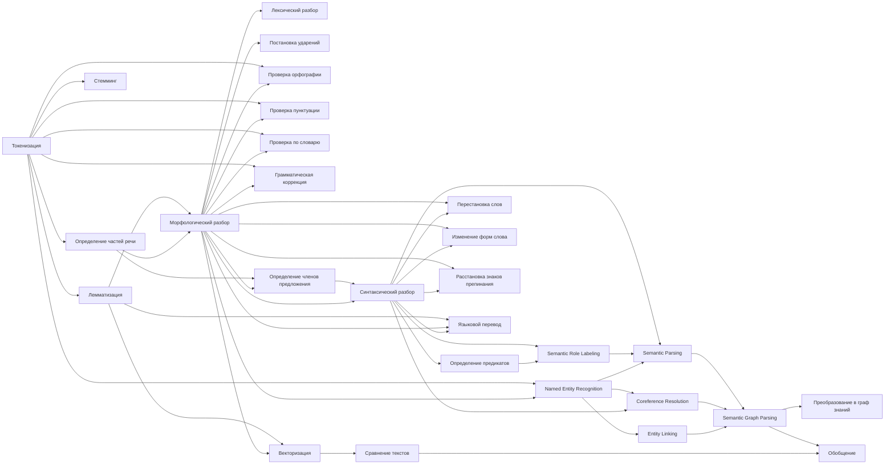

# Карта Знаний. Лингвистика

## Источники

- Русский язык. 2012 год. Теория. 5-9 классы. Бабайцева. Чеснокова
- [A Comparison of Lexical Tokenization Methods](https://ideaexchange.uakron.edu/cgi/viewcontent.cgi?article=3344&context=honors_research_projects)
- [Universal POS tags](https://universaldependencies.org/u/pos/)
- [Universal Dependency Relation](https://universaldependencies.org/u/dep/)

## Идеи

- Слова содержащиеся в тексте повод подумать о наличии **Связи** которую нужно вытащить из текста: для
- Использовать одну из метрик для проверки похожести текстов — мешок слов. Использовать даже при наличии более подходящих метрик.
- Использовать UD формат и SRL‑модуль.

## Цель

Целевая форма: [глагол]-[объект❓]-[субъект❓]
Формулировка задачи: Seq2Graph — преобразование произвольного текста в семантический граф знаний. NER, Извлечение фактов/отношений (Relation Extraction), Coreference Resolution → слияние узлов, Entity Linking → выравнивание узлов по онтологиям, Semantic Parsing, Semantic Graph Parsing




❌ — сложная задача, её нужно пропустить, к ней лучше подступаться позже

- Записываем сюда все возможные операции над текстом в порядке их применения. Грамемы
  1. ❌ (на 2025.07.04) Этимология слова (история, словообразование)
  2. ❌ (на 2025.07.04) Морфемный разбор (разбор слова по составу, морфемика)
    - Основа слова
      - Приставка (Префикс)
      - Корень
      - Суффикс
    - Аффиксы
      - Префикс (Приставка)
      - Суффикс
      - Окончание
      - Постфикс
  3. Сегментация — разделение текста на логические единицы (сегменты) на разных уровнях лингвистического анализа
     - Токенизация (Tokenization)
     - Сегментация предложений (Sentence Segmentation)
     - Сегментация абзацев
     - Сегментация документов
     - Морфологическая
     - Семантическая
     - Диалоговая
  4. Токенизация (❗ Нужно выбрать токинезациию соответствующую итоговой метрике той конечной задачи которую мы решаем)
    - White Space. Деление предложения на слова по пробелам
    - Word
    - Sentence
    - Character
    - N-gram
    - Regular Expression
    - Penn Treebank
    - Subword
    - Byte Pair Encoding (BPE)
    - WordPiece
  - Лемматизация
    - Стеминг
  - Разбор предложения
    - Определение частей речи
      - Глагол
        - Вид
          - Совершённый
          - Не совершённый
        - ❓
          - Инфинитив
        - ❓Аргументы (как предиката)
          - Транзитивность
          - Интранзитивность
          - Сериальные конструкции
          - ❓
        - ❓
          - Телиситет (telicity) (способность глагола обозначать завершённое действие)
        - Согласованность
          - По лицу
          - По числу
      - Наречие
      - Существительное
        - Изменяется по
          - Падеж
          - Число
          - Род
          - Склонение
      - Прилагательное
      - Местоимение
      - Союз
      - Частица
      - Предлог
      - Числительное
      - Причастие
      - Деепричастие
      - Междометие
      - Артикль (только в английском, служебная часть речи)
        - Определённый
        - Неопределённый
        - Нулевой
        - Частичного количества. Частичный. Партитивный артикль
    - Определение членов предложения
      - Подлежащее
      - Сказуемое
        - Составное глагольное
      - Дополнение
      - Обстоятельство
      - Определение
      - ❓
    - Характеристика предложения
      - По цели высказывания
        - Повествовательное
        - Вопросительное
        - Побудительное
      - По интонации
        - Невосклецательное
      - По сложности
        - Простое
        - Сложное
      - По наличию главных членов
        - Односоставное
      - По наличию второстепенных членов
        - Распространённое
      - По осложнённости
        - Не осложнено обращениями
        - Не осложнено вводными словами
        - Не осложнено однородными членами
  - Проверка на ошибки
    - По правилам языка
    - По словарю
    - Пуктуация
    - Орфография
  - ❓ Определение номенативности языка
  - Определение лексем
  - Постановка ударений
  - Лексический разбор ❓
  - Морфологический разбор ❓
  - Грамматический разбор ❓
  - Синтаксический разбор ❓
  - Лексический разбор ❓
  - Определение наклонения
    - Изъявительное
    - Повелительное
    - Сослагательное
  - Удаление оценочных суждений или преобразование в предполагаемые
  - Изменение форм слова
  - Поиск однокоренных
  - Поиск синонимов
  - Поиск антонимов
  - Порядок слов
  - Определение полярности
    - Утвердительное
    - Отрицательное
  - Определение одушевлённости
  - Определение счётности
  - Определение падежа
  - Определение времени
  - Определение рода
    - Мужской
    - Женский
    - Средний
  - Определение лица
  - Определение числа
  - Определение склонения
  - Определение спряжения
  - Определение краткости
  - Определение степени
  - Определение залога
    - Действительный. Активный. Актив. Прямой в номинативных языках
    - Страдательный. Пассивный. Пассив. Косвенный в номинативных языках
    - Рефлексив. Возвратный
    - Реципрок. Взаимный
    - Медий. Средний
    - Антипассив. Косвенный
    - Эргативный. Эргативная конструкция. Прямой в эргативных языках
    - Имперсонал. Безличный залог
    - Каузатив. Причинительный. Понудительный залог
  - Расстановка знаков препинания
  - Перестановка слов (но лучше найти вариации семантического графа так как их меньше из-за отсутствия зависимости от некоторых перестановок)
    - С сохранением смысла
    - Без сохранения смысла, но сохранением валидности грамматики
    - Без сохранения смысла и валидности грамматики
  - Преобразование в граф
  - Векторизация
  - Сравнение
    - Мешок слов
    - Косинусное расстояние
    - ❓
  - Обобщение
  - Языковой перевод


- Все библиотеки для NLP
  - spaCy
  - nltk
  - gensim
  - deeppavlov
  - natasha
  - pymorphy
  - UDPipe
  - pymystem3
  - PyDictionary

([Тут должны быть все грамемы](https://universaldependencies.org/u/feat/all.html))

Обозначения в библиотеках
| Часть речи             | Part of Speech            | spaCy | pymorphy2                             |
| ---------------------- | ------------------------- | ----- | ------------------------------------- |
| существительное        | noun                      | NOUN  | NOUN                                  |
| имя числительное       | numeral                   | NUM   | NUMR                                  |
| имя собственное        | proper noun               | PROPN |                                       |
| местоимение            | pronoun                   | PRON  | NPRO                                  |
| прилагательное         | adjective                 | ADJ   | ADJF (полное), ADJS (краткое)         |
| глагол                 | verb                      | VERB  | VERB (личная форма), INFN (инфинитив) |
| вспомогательный глагол | auxiliary                 | AUX   |                                       |
| наречие                | adverb                    | ADV   | ADVB                                  |
| ?расположение          | adposition                | ADP   |                                       |
| ?согласованный союз    | coordinating conjunction  | CCONJ |                                       |
| ?союз                  | conjunction               |       | CONJ                                  |
| ?определитель          | determiner                | DET   |                                       |
| междометие             | interjection              | INTJ  | INTJ                                  |
| частица                | particle                  | PART  | PRCL                                  |
| ?подчинительный союз   | subordinating conjunction | SCONJ |                                       |
| символ                 | symbol                    | SYM   |                                       |
| пунктуация             | punctuation               | PUNCT |                                       |
| компаратив             | —                         | PUNCT | COMP                                  |
| причастие (полное)     | —                         | PRTF  |                                       |
| причастие (краткое)    | —                         | PRTS  |                                       |
| деепричастие           | —                         | GRND  |                                       |
| предикатив             | —                         | PRED  |                                       |
| предлог                | —                         | PREP  |                                       |


| Падеж                          | Case | spaCy | pymorphy2 |
| ------------------------------ | ---- | ----- | --------- |
| именительный                   |      |       | nomn      |
| родительный                    |      |       | gent      |
| дательный                      |      |       | datv      |
| винительный                    |      |       | accs      |
| творительный                   |      |       | ablt      |
| предложный                     |      |       | loct      |
| звательный                     |      |       | voct      |
| второй родительный (частичный) |      |       | gen2      |
| второй винительный             |      |       | acc2      |
| второй предложный (местный)    |      |       | loc2      |


| Число               | Case | spaCy | pymorphy2 |
| ------------------- | ---- | ----- | --------- |
| единственное число  |      |       | sing      |
| множественное число |      |       | plur      |


- Это уже другой пайпланйн — для алгоритмов Карты Знаний, не делать в лингвистике, убрать из лингвистики
  - Определение предикатов
  - Проверка на логику

## 
##
##


##  
## 
## 
## 
## 
## 
## 
## 
## 
## 
## 
## 
## 
## 
## 
## 
## 

## План: Построение цепочек действий из паттернов
Цель
Создать систему связывания паттернов (глаголов) в цепочки действий, которые соответствуют последовательности действий в научной статье для воспроизведения результатов.
Архитектура решения
1. Backend: Сервис построения цепочек действий
Создать: api/services/action_chain_service.py Основной алгоритм:
Извлечь все паттерны глаголов (POS=VERB)
Для каждой пары глаголов определить тип связи на основе:
Прямые лингвистические связи (приоритет 1): xcomp, advcl, conj, ccomp
Маркеры последовательности (приоритет 2): after, then, before, next, etc.
Позиция в тексте (приоритет 3): sent_idx, token_idx
Общий аргумент (приоритет 4): одни и те же объекты в разных действиях
Взвешивать все факторы через confidence score
Создать связи между паттернами: Pattern(глагол1) -[ACTION_SEQUENCE]-> Pattern(глагол2)
Создать связи между свойствами: Property(TEXT="колба") -[SAME_ENTITY]-> Property(TEXT="колба")
Типы связей ACTION_SEQUENCE:
TEMPORAL_AFTER - временная последовательность
TEMPORAL_BEFORE - обратная временная
CAUSAL - причинно-следственная
PURPOSE - целевая
RESULT - результат
COORDINATION - координация (параллельные действия)
2. Backend: API endpoints
Создать: api/src/routers/data_extraction/action_chains.py Endpoints:
POST /api/data_extraction/patterns/action-chains/build - построить цепочки
GET /api/data_extraction/patterns/action-chains - получить существующие цепочки
GET /api/data_extraction/patterns/action-chains/statistics - статистика
3. Расширение модели данных Neo4j
Новые связи:
// Связь между паттернами действий
(Pattern)-[ACTION_SEQUENCE {
    sequence_type: 'TEMPORAL_AFTER',
    confidence: 0.85,
    evidence: ['direct_dependency:advcl', 'marker:after'],
    created_at: timestamp()
}]->(Pattern)

// Связь между свойствами (отслеживание объектов)
(PatternProperty)-[SAME_ENTITY {
    confidence: 0.95,
    entity_type: 'INSTRUMENT|MATERIAL|RESULT',
    created_at: timestamp()
}]->(PatternProperty)
4. Frontend: UI для визуализации цепочек
Создать: client/src/components/Data_extraction/ActionChains/ Компоненты:
ActionChainBuilder.tsx - кнопка построения + прогресс
ActionChainVisualization.tsx - визуализация графа цепочек
ActionChainList.tsx - список цепочек в текстовом формате
Интеграция: Добавить в существующий блок "Паттерны" или создать отдельный блок "Цепочки действий"
5. Алгоритм определения связей
Функция: determine_action_sequence(verb1, verb2)
### Шаг 1: Проверить прямую синтаксическую связь
if has_dependency(verb1, verb2, ['xcomp', 'advcl', 'ccomp']):
    confidence += 0.8
    sequence_type = map_dependency_to_sequence(dep_type)

### Шаг 2: Искать маркеры последовательности между глаголами
markers = find_markers_between(verb1, verb2)
if markers:
    confidence += 0.6
    sequence_type = marker_to_sequence_type(markers[0])

### Шаг 3: Проверить позицию в тексте
if adjacent_sentences(verb1, verb2):
    confidence += 0.3
elif same_sentence_sequential(verb1, verb2):
    confidence += 0.2

### Шаг 4: Проверить общие аргументы (объекты)
shared_entities = find_shared_entities(verb1, verb2)
if shared_entities:
    confidence += 0.4
    create_entity_links(shared_entities)

### Решение: создать связь если confidence >= 0.5
if confidence >= 0.5:
    create_action_sequence(verb1, verb2, sequence_type, confidence)
6. Алгоритм связывания свойств (отслеживание объектов)
Функция: link_entity_properties()
### Найти свойства TEXT с одинаковым значением
### связать их как SAME_ENTITY для отслеживания
### объекта через разные действия
### Пример: "колба" в "поставили колбу" и "в колбу налили"
Этапы реализации
✅ Создать action_chain_service.py с функциями извлечения глаголов
✅ Реализовать алгоритм определения связей между паттернами
✅ Создать функции для создания связей в Neo4j
✅ Создать API endpoints для построения цепочек
✅ Создать UI компонент для построения цепочек
✅ Создать UI компонент для визуализации графа цепочек
✅ Интегрировать в существующий UI
Ожидаемый результат
После реализации в Neo4j будет граф:
Pattern(cultured) -[ACTION_SEQUENCE:TEMPORAL]-> Pattern(analyzed)
Pattern(analyzed) -[ACTION_SEQUENCE:RESULT]-> Pattern(showed)

Property("cells") -[SAME_ENTITY]-> Property("cells")
Property("DMEM medium") -[SAME_ENTITY]-> Property("medium")
UI покажет:
Кнопку "Построить цепочки действий"
Прогресс-бар построения
Граф цепочек действий
Статистику: количество цепочек, средняя confidence, типы связей


========================================

Хорошо, я соберу полный список всех грамем английского языка — включая морфологические, синтаксические, семантические и прагматические категории. Также уточню возможные региональные различия (британский и американский варианты) и особенности классификации.
Я сообщу, когда исследование будет готово.


# Грамматические категории английского языка (грамемы)

## Морфологические категории

* **Число (Number)** – две значения: единственное (*singular*) и множественное (*plural*). У существительных множественное число образуется обычно добавлением -s (например, **book – books**), причём есть нерегулярные формы (*man – men, child – children*). Местоимения и глаголы также различаются по числу: в третьем лице ед.ч. настоящего времени глагол получает окончание -s (he *walks*). Категория обязательна для существительных, местоимений и проявляется в согласовании глагола с подлежащим.
* **Падеж (Case)** – отмечается у местоимений (три значения: именительный/subjective, винительный/objective, притяжательный/possessive) и частично у существительных (притяжательный). Например, личное местоимение 1-го лица единственного числа: **I (nom.) – me (acc.) – my (poss.)**. Существительные имеют possessive-падеж с суффиксом -'s (*the cat’s toy*). Именительный/винительный падеж существительных (роль подлежащего/дополнения) не маркируется формально.
* **Род (Gender)** – в современном английском грамматический род существительных отсутствует; сохраняется лишь естественный (natural) род в системе местоимений. Так, местоимения *he/him/his* – мужского рода, *she/her/hers* – женского, *it/it/its* – среднего (для предметов, животных без обозначения пола). Архаичные формы типа *actor/actress* или местоимения *thou/thee* соответственно устарели.
* **Лицо (Person)** – категория местоимений: первое (I, we), второе (you) и третье (he, she, it, they). Например, *I* – 1-е лицо ед.ч., *we* – 1-е мн.ч., *you* – 2-е (ед. и мн.), *he/she/it*, *they* – 3-е. Местоимения и спрягаемые глаголы согласуются по лицу (см. окончание -s в he **walks**).
* **Время (Tense)** – простые формы времён: **present** и **past** (настоящее и прошедшее). Например: *I **work*** (present), *I **worked*** (past). Формы будущего времени в английском не кодируются отдельной формой глагола: будущее выражается модальным *will* или конструкцией *be going to*, поэтому «future tense» не считается собственным морфологическим временем.
* **Вид (Aspect)** – передаёт вид действия: **simple** (действие без структуры во времени), **continuous/progressive** (продолженное), **perfect** (завершённое). Например: *he **writes*** (simple), *he **is writing*** (continuous), *he **has written*** (perfect), *he **has been writing*** (perfect continuous). Комбинация этих значений («perfect progressive» и др.) образуется аналитически (с вспомогательными глаголами).
* **Наклонение (Mood)** – **indicative** (изъявительное), **imperative** (повелительное), **subjunctive** (сослагательное). Например: *He writes* (indicative), *Write!* (imperative, подразумевается “you write”), *I demand that he **write*** (subjunctive: *write* без -s после that). Изъявительное – основное наклонение; повелительное используется для команд. Сослагательное используется редко и преимущественно в формальных конструкциях (*It is essential that she be present*).
* **Залог (Voice)** – два значения: **active** (действительный) и **passive** (страдательный). Активный залог: подлежащее выполняет действие (*The cat ate the mouse*). Пассивный: подлежащее подвергается действию (*The mouse was eaten by the cat*). Пассивный залог образуется сочетанием *be* + причастие прошедшего времени.
* **Степень (Degree)** – для качественных прилагательных и наречий: **positive** (положительная), **comparative** (сравнительная), **superlative** (превосходная). Например: *big – bigger – biggest*, *carefully – more carefully – most carefully*. Имеются и неправильные формы (*good – better – best*). Сравнительная степень может выражаться и при помощи *more/most* (особенно с длинными прилагательными).

## Синтаксические категории

* **Типы предложений (Sentence types)** – по цели высказывания: **декларативные** (утвердительные), **вопросительные** (общие/специальные вопросы), **императивные** (повелительные) и **восклицательные**. Например: *It is raining.* (декларативное); *Is it raining?* (вопросительное); *Open the window.* (императив); *What a beautiful day!* (восклицательное). Каждый тип имеет характерный синтаксический строй: порядок слов, наличие вспомогательных глаголов do/does, интонацию и т. д. В повествовательном и вопросительном предложении подлежащее обычно выражается местоимением или существительным (кроме безличных конструкций).
* **Предложение** – основная синтаксическая единица: простое или сложное, главное и придаточное. Грамматические категории наклонения и залога уже включают синтаксическую информацию (см. раздел «Наклонение»). Например, придаточные изъяснительные часто вводятся союзами *that, if, whether* и пр. (не «грамемы» в узком смысле, но отражают синтаксическую структуру).
* **Порядок слов** – в английском фиксирован: SVO (Subject–Verb–Object). Изменение порядка (например, в вопросах, отрицании, конструкциях there is) подчиняется грамматическим правилам.

## Семантические категории

* **Одушевлённость (Animacy)** – не выражается формально, но учитывается при выборе местоимений и иногда при управлении глагола (например, *teach* – человек, *learn* – предмет). В грамматике английского отделяется природный род (муж./жен./ср.) местоимений.
* **Счётность (Countability)** – существительные делятся на исчисляемые (countable) и неисчисляемые (uncountable). Исчисляемые могут иметь множественное число (*apple – apples*), неисчисляемые (*water*, *information*) множественного числа не имеют. Многие слова могут быть и тем, и другим в разных значениях (например, *chicken* как животное/мясо). От этого зависит употребление артиклей и числительных (one *book* vs *some* *water*).
* **Определённость (Definiteness)** – семантическая категория известности: **дефинированность (definite)** против **недефинированности (indefinite)**. В английском выражается артиклями: определённый *the* (уже известный или уникальный объект) и неопределённый *a/an* (любой из класса). Например, *the sun* (единственное светило), *a sun* (какое-либо звёздное солнце в другом контексте). Указательные местоимения (*this, that*) также маркеры определённости.
* **Обобщённость (Genericity)** – когда существительное используется в обобщённом смысле (о классе в целом): *The tiger is dangerous* (о виде), *Tigers are dangerous*. Обычно в английском для обобщений можно использовать артикль *the* или множественное число (см. пример).
* **Временные соотношения** – значения времен и аспектов (см. выше) связаны с семантикой времени: прошедшее указывает на прошлое, настоящее – на текущее или вообще (см. *eternal present*), perfect – на факт завершённости действия к моменту речи.
* **Полярность** – утвердительная vs отрицательная форма влияет на значение: наличие *not*/*n’t* после вспомогательного глагола меняет смысл предложения.

## Прагматические категории

* **Вежливость и стиль** – выражается в выборе модальных конструкций, интонации и обращений. Например, для вежливых вопросов часто используют *could/would you...* вместо прямого *can you...?*, добавляют *please*. Повелительное наклонение может быть смягчено частицей *please* или конструкциями «*would you mind…*». Также важен регистр: формальные местоимения (*shall* I/we? – формал., особенно в BrE) vs бытовые (*should I/we?* – AmE), обращение *Mr/Ms* и т.д.
* **Различия британского и американского вариантов** – в грамматических «грамемах» не так много, но встречаются. Например, в американском английском часто используется прошедшее причастие *gotten* (в то время как в Британии обычно говорят *got*). В американском более распространено употребление простого прошедшего вместо present perfect в некоторых контекстах (*I already ate* вместо британского *I have already eaten*). Разные союзы/предлоги и формы (BrE: *at the weekend*, AmE: *on the weekend*; коллективные существительные: BrE допускает множественное согласование (*The team are...*), AmE предпочитает единственное (*The team is...*)). Устаревшие конструкции (как *shall* для будущего, *whilst*, архаизмы) сегодня в США почти не употребляются.

Статус перечисленных грамматических категорий: некоторые из них обязательны (например, согласование по числу/лицу у глагола), некоторые факультативны или сохраняются лишь в формальных/устаревших конструкциях (например, сослагательное наклонение, «различение\*-shall/will\* во 2‑м лице, грамм. род существительных и т.п.).

**Источники:** Cambridge Grammar и другие справочники по английскому (Murphy, Huddleston & Pullum и пр.), а также учебные ресурсы.


======

Ниже приведён исчерпывающий перечень «грамем» — то есть грамматических категорий английского языка — с подробным описанием их значений, форм, способов выражения, примерами и статусом в современной речи.

---

## I. Морфологические грамемы

- Число (Number)
  - Значение
    - singular (единственное)
    - plural (множественное)
  - Выражение
    - Существительные: окончание –**s** (cats), нерегулярно (men, children)
    - Местоимения: I/we, you/you, he, she, it/they
    - Глаголы: согласование с подлежащим в 3‑м л. ед. ч. (he **walks**)
  - Статус: обязательная грамема для существительных, местоимений и согласования глаголов.
- Падеж (Case)
  - Значение
    - *nominative* (именительный – subjective)
    - *objective* (винительный – accusative/dative)
    - *possessive* (притяжательный)
  - Выражение
     - Личные местоимения: I – me – my, he – him – his, she – her – her, we – us – our, they – them – their
     - Существительные: суфикс **–’s** (the cat’s tail); объектный падеж ни­как не маркируется (the cat sees the dog).
  - Статус: обязательная для местоимений; «имя/объект» для существительных — за счёт порядка слов.
- Лицо (Person)
  - Значения**:
    - 1 лицо (I, we)
    - 2 лицо (you)
    - 3 лицо (he, she, it, they)
  - Выражение: личные местоимения и согласование форм глагола (I/you/we/they **are**, he/she/it **is**).
  - Статус: обязательна для местоимений и вспомогательных глаголов.
- Время (Tense)
  - Значения:
    - Present (настоящее)
    - Past (прошедшее)
  - Выражение:
    - Простое: I **work** / I **worked**
    - Будущее через модальный *will* или конструкцию *be going to* (не морфологическое).
  - Статус: обязательная категория; «будущее» — аналитическое.
- Вид (Aspect)
  - Значения:
    - Simple
    - Progressive (continuous)
    - Perfect
    - Perfect progressive
  - Выражение: вспомогательные глаголы *be*, *have* + основная форма/ причастие: is writing, *has written*, *has been writing*.
  - Статус: обязательна для глагольных форм.
- Наклонение (Mood)
  - Значения:
    - Indicative* (изъявительное)
    - Imperative* (повелительное)
    - Subjunctive* (сослагательное)
  - Выражение:
    - Indicative: обычный порядок слов.
    - Imperative: глагол без «you». (*Open the door!*)
    - Subjunctive: после certain verbs/натуральных конструкций: *I suggest that he *be* ready.*
  - Статус: subjunctive — редок, формален; imperative и indicative — обязательны.
- Залог (Voice)
  - Значения:
    - Active (действительный)
    - Passive (страдательный)
  - Выражение:
    - Active: The cat **ate** the mouse.
    - Passive: The mouse **was eaten** (by the cat).
  - Статус**: passive распространён, active по умолчанию.
- Род (Gender)
  - Значения: natural (природный): masculine, feminine, neuter
  - Выражение: только в местоимениях; у существительных грамм. род отсутствует.
  - Статус: обязательна для местоимений; для существительных — устаревшие формы (actor/actress).
- Степень (Degree)
  - Значения: positive, comparative, superlative
  - Выражение: суффиксы –er / –est или слова *more*/*most*
  - Статус: обязательна для качественных прилагательных и наречий.

## II. Синтаксические грамемы

- Порядок слов (Word Order)
  - Значения:
    - Основной: S V O (Subject, Verb, Object — подлежащее, сказуемое (глагол или состояние), дополнение)
    - Вопросительный: вспомогательный глагол + S + V;
    - Императив: глагол + O;
  - Статус: фиксирован, ключевой для понимания ролей (кто объект, а кто субъект).
- Тип предложения (Sentence Type)
  - Значения:
    - Declarative (повествовательное)
    - Interrogative (вопросительное: yes/no, wh‑questions)
    - Imperative (повелительное)
    - Exclamatory (восклицательное)
  - Статус: обязательна категория для коммуникативной функции.
- Классификация придаточных (Clause Subordination)
  - Значения:
    - Изъяснительные (*that*, *if*, *whether*)
    - Определительные (*which*, *who*, *whose*)
    - Обстоятельственные (*when*, *where*, *because*, *although*)
  - Статус: обязательна для сложноподчинённых конструкций.
- Односоставность/двусоставность
  - Англ. практически всегда двусоставные — подлежащее + сказуемое.
  - Статус: двусоставность — по умолчанию.

---

## III. Семантические грамемы

1. **Одушевлённость (Animacy)**

   * *animate* vs *inanimate*
  - Статус**: влияет на выбор местоимений и передачу смысла (the lion vs the rock).

2. **Счётность (Countability)**

   * *countable* vs *uncountable*
  - Статус**: обязательна для существительных (one apple vs some water).

3. **Определённость (Definiteness)**

   * *definite* (the) vs *indefinite* (a/an)
  - Статус**: обязательна для артиклей; zero-article для мн.ч. обобщений.

4. **Обобщённость (Genericity)**

   * *The tiger is endangered* vs *Tigers are endangered*
  - Статус**: синтаксические средства (the + singular; plural bare).

5. **Полярность (Polarity)**

   * *positive* vs *negative* (наличие «not»)
  - Статус**: обязательна; образуется вспомогательным глаголом + not.

6. **Темпоральные соотношения**

   * взаимодействие tense ↔ aspect
  - Статус**: см. раздел «Морфологические».

---

## IV. Прагматические грамемы

1. **Вежливость (Politeness)**

   * выбор модальностей (*could you…*, *would you…*)
   * использование *please*, *thank you*
  - Статус**: факультативна, но критична в социальном общении.

2. **Регистр (Register)**

   * *formal* vs *informal*
   * лексика (*children* vs *kids*), грамм. конструкции (*shall* vs *will*)
  - Статус**: стилистический; неявно маркируется лексикой и формами.

3. **Интонационные функции**

   * оформление вопроса, восклицания, эмфатического порядка слов (*It is John who did it!*)
  - Статус**: не отражается письменно, но важно для устной речи и перевода грам. функций.

---

> **Итого**: мы охватили 9 морфологических, 4 синтаксических, 6 семантических и 3 прагматических грамемы, вместе — **22** базовые категории.
> Каждая из них порождает множество форм и комбинаций, но сама категория является «грамемой» – минимальной единицей грамматического значения.


## Как определять синтаксические связи в тексте

### Цель и подход

- Нужен способ понять: от какого слова к какому вести связь, какой вопрос задавать и как это помогает извлекать смысл.
- Практичная основа — зависимостная синтаксис (UD/spaCy): у каждого токена один «head» и помеченная связь.

### Базовые принципы (EN и RU)

- Предикат: в клаузе головным чаще всего является личный (спрягаемый) глагол — корень клаузы.
- Именная группа: головное — существительное; детерминативы/прилагательные зависят от него.
- Предложная группа (UD): головное — имя; предлог — зависимый с меткой case.
- Копула: головное — именная/прилагательная предикативная часть; глагол-связка — cop.
- Координация: первым конъюнктом считают голову; остальные — conj, союз — cc.

### Аргумент vs модификатор

- Аргументы (подлежащее, прямое/косвенное дополнения, клаузы-комплементы) предписаны валентностью головы.
- Модификаторы (обстоятельства, прилагательные, обличные члены) необязательны, добавляют обстоятельства.

### Какой вопрос задавать? (эвристика)

- nsubj (подлежащее): кто?/что? кто выполняет действие.
- obj (прямое доп.): что?/кого? над чем действие.
- iobj (косвенное): кому?/чему? адресат/бенефициар.
- obl (обстоятельство): где?/когда?/как?/почему?/чем?
- advmod (наречное модифиц.): как?/когда?/где?
- amod (прил. модифиц. сущ.): какой?/чей?
- nmod (именная модификация, «of/род.»): чего?/чей?
- ccomp/xcomp (клаузные комплементы): что?/чтобы? какая пропозиция.

Примечание: вопросы — удобная эвристика, но проверяйте валентность, согласование и падежи.

### Примеры: английский

1. “The quick brown fox jumps over the lazy dog.”
- Корень: jumps.
- nsubj: fox (кто прыгает? — лиса/fox).
- det/amod: The/quick/brown → fox.
- obl: dog как голова PP; over — - case → dog; amod: lazy → dog.
- Вопросы:
  - Кто прыгает? — fox (nsubj)
  - Прыгает через что? — dog (obl с over как case)
2. “He gave her the book.”
- Голова: gave
- nsubj: He (кто дал?)
- iobj: her (кому?)
- obj: the book (что?)
- Тест пассивом: “She was given the book” подтверждает iobj.
3. Двусмысленность: “I saw the man with a telescope.”
- Чтение A (инструмент): with a telescope → saw (obl: чем? — телескопом)
- Чтение B (атрибут человека): with a telescope → man (nmod: какой человек?)

### Примеры: русский

1. “Быстрая коричневая лиса перепрыгнула через ленивую собаку.”
- Корень: перепрыгнула.
- nsubj: лиса (И.п.; кто перепрыгнула?)
- amod: быстрая, коричневая → лиса (какая?)
- PP: голова — собаку (В.п.); через — case → собаку.
- amod: ленивую → собаку.
- Вопросы:
  - Кто перепрыгнула? — лиса (nsubj)
  - Перепрыгнула через что? — собаку (obl с предлогом через)
2. “Он дал ей книгу.”
- Голова: дал
- nsubj: Он (кто дал?)
- iobj: ей (Д.п.; кому?)
- obj: книгу (В.п.; что?)
- Свободный порядок слов возможен; роли различимы по падежам.
3. Копула:
- “Иван — учитель.” Голова: учитель; nsubj: Иван; тире — punct.
- “Иван является учителем.” Голова: учителем; cop: является; nsubj: Иван.

### Как решать, куда вести связь: чек‑лист

- Найдите личный глагол в каждой клаузе — это голова.
- Найдите подлежащее:
  - Английский: NP перед глаголом; проверяйте пассив.
  - Русский: И.п. + согласование с глаголом.
- Присоедините обязательные аргументы по валентности:
  - Английский: прямое доп. после переходного; «предложные объекты» с требуемым предлогом.
  - Русский: управляемые падежи (В.п. — прямой объект, Д.п. — адресат, Р.п. — при отрицании/ряд глаголов).
- PP/обстоятельства:
  - Если отвечают где/когда/как/почему и опциональны — obl к глаголу.
  - Если уточняют имя (какой?/чего?) — nmod к существительному.
- Модификаторы:
  - Прилагательные → существительное (amod); наречия → глагол/прил./нар. (advmod).
- Копулы и координации — по правилам выше.
- Разрешайте неоднозначности через:
  - Морфологию (падежи в русском), списки управления (какие дополнения требует лексема), порядок слов (англ.), подстановку/перестановку, семантическую правдоподобность.

### Заметки по spaCy/UD

- spaCy следует Universal Dependencies:
  - Предлоги — case‑зависимые; именем головы PР считают существительное.
  - Копулы (be, «являться/быть») — cop, голова — именная часть.
  - Координация: первая часть — голова; союз — cc; остальные — conj.
- Быстрый просмотр анализа (EN):
  - `import spacy; nlp = spacy.load("en_core_web_sm"); doc = nlp("The student read a book in the library yesterday.")`
  - `for t in doc: print(t.text, t.dep_, t.head.text)`
- Быстрый просмотр анализа (RU):
  - `import spacy; nlp = spacy.load("ru_core_news_sm"); doc = nlp("Студент прочитал книгу в библиотеке вчера.")`
  - `for t in doc: print(t.text, t.dep_, t.head.text)`

### Шпаргалка: метка → вопрос

- nsubj: кто?/что? — исполнитель.
- obj: что?/кого? — объект воздействия.
- iobj: кому?/чему? — адресат/бенефициар.
- ccomp/xcomp: что?/чтобы? — пропозиция/предикативное дополнение.
- obl: где?/когда?/как?/почему?/чем? — обстоятельства.
- advmod: как?/когда?/где? — наречные модификаторы.
- amod: какой?/чей? — атрибут сущ.
- nmod: чего?/чей? — родительные/«of»‑модификаторы.
- det: какой?/который? — определители/артикли.
- case: предлог — служебное, сам вопрос не задают.
- cop/aux/mark/cc: служебные; вопрос к ним не формулируем.

### Как извлекать смысл

- Для каждой клаузы определите корень и ядро ролей: кто что сделал кому, когда/где/как.
- Сопоставьте UD‑метки с семантическими ролями: Agent/Patient/Recipient/Location/Time.
- Снимайте неоднозначности сочетанием синтаксиса (валентность, падеж/порядок) и семантики.

Если пришлёте 2–3 своих предложения (EN и RU), разметю их: укажу головы, связи и точные «вопросы» между словами.


## Предлог. Adposition

Определение
- Предлог — служебная часть речи, выражающая синтаксические отношения между знаменательными словами и связывающая зависимое имя (существительное/местоимение/числительное) с другим словом в высказывании; предлог управляет падежом имени и сам по себе не является членом предложения.

Свойства
- Невозможность самостоятельной синтаксической функции: входит в состав предложно-именного сочетания.
- Не изменяется и не согласуется; задаёт тип отношения и требуемый падеж.
- Семантика отношений: пространственные (в, на, из), временные (до, после), причинные (из‑за), целевые (для), объектные (о/об), инструментальные (с, при), адресата (к), сопутствия (с), уступки/противопоставления (вопреки).
- Классификация:
  - Непроизводные: в, на, к, у, из, от, с, по, о(б), при.
  - Производные: благодаря, согласно, вследствие, ввиду, наподобие.
  - Сложные/составные: из‑за, из‑под, по мере, в течение, в связи с и т. п.

Примеры
- в доме (место: где? — П.п.), в дом (направление: куда? — В.п.)
- к другу (адресат: кому? — Д.п.)
- из‑за дождя (причина: чего? — Р.п.)
- English: in the house, to the city, because of rain.

Заметка по UD/spaCy
- Часть речи `ADP`; в разборе UD голова — имя, а предлог — зависимый с меткой `case` (например, `в` → `домe`).

## Обстоятельство

Определение
- obl (oblique nominal) в UD — это обличное (обстоятельственное) именное дополнение: не‑ядерный зависимый предиката (обычно глагола), выражающий место/время/способ/причину/инструмент и т. п. Часто оформлен предлогом или «косвенным» падежом. Предлог при этом — case к самому имени.

Отличия от obj и nmod
- obj: ядерный объект глагола (прямой; без предлога в англ./рус.). obl: не‑ядерный, чаще с предлогом/косвенным падежом.
- nmod: номинальная модификация имени (отношение «у имени к имени»). obl: зависимая группа у предиката (глаг./прилаг./копул. именной).

Примеры (EN)
- He lives in London. → lives — head; London — obl; in — case.
- She wrote with a pen. → wrote — head; pen — obl; with — case.
- The room is full of people. → full — head; people — obl; of — case.

Примеры (RU)
- Он живёт в Москве. → живёт — head; Москве — obl; в — case.
- Мы шли пешком. → шли — head; пешком — obl (твор. без предлога).
- Книга написана Пушкиным. → агент пассива: Пушкиным — obl:agent.

Если нужно, могу разметить ваши предложения и показать, где obl, а где obj/nmod.

## Члены предложения

Короткий ответ
- В spaCy «члены предложения» не выделяются термином традиционной русской грамматики, но их можно получить через зависимости UD: nsubj (подлежащее), ROOT/сказуемое, obj/iobj (дополнения), obl/advmod (обстоятельства), amod/nmod/acl (определение и др.).
- В документации это разделы про синтаксический разбор: “Dependency Parse”, “Linguistic Features → Syntactic Dependencies”, атрибуты Token.dep_, Token.head, Token.children, Token.subtree, и визуализация displacy. Для расшифровки меток есть spacy.explain().

Как извлечь «члены предложения» в коде
- Идея: разбить на предложения (doc.sents), взять корень (dep_ == "ROOT") как сказуемое; затем сгруппировать токены по меткам.

Пример функции (EN/RU модели, UD-метки одинаковые):

```python
import spacy
def span_from_head(tok):
    idxs = [t.i for t in tok.subtree]
    return tok.doc[min(idxs):max(idxs)+1].text

SUBJECT_DEPS = ("nsubj", "nsubj:pass", "csubj", "csubj:pass")
ADVERBIAL_DEPS = ("obl", "advmod") # учтём подтипы через startswith
ATTRIBUTE_DEPS = ("amod", "nmod", "appos", "acl")
OBJECT_DEPS = ("obj", "iobj")
CLAUSAL_DEPS = ("ccomp", "xcomp")

def clause_roles(doc):
    out = []
    for sent in doc.sents:
        root = next((t for t in sent if t.dep_ == "ROOT"), None)
        roles = {
            "predicate": span_from_head(root) if root else "",
            "subjects": [],
            "objects": [],
            "iobjects": [],
            "clausal_complements": [],
            "adverbials": [],
            "attributes": [],
        }
    for tok in sent:
        d = tok.dep_
        if d.startswith(("nsubj", "csubj")):
        roles["subjects"].append(span_from_head(tok))
        elif d == "obj":
        roles["objects"].append(span_from_head(tok))
        elif d == "iobj":
        roles["iobjects"].append(span_from_head(tok))
        elif d in CLAUSAL_DEPS:
        roles["clausal_complements"].append(span_from_head(tok))
        elif d == "obl" or d.startswith("obl:") or d == "advmod":
        roles["adverbials"].append(span_from_head(tok))
        elif d in ATTRIBUTE_DEPS:
        roles["attributes"].append(span_from_head(tok))
        out.append({"text": sent.text, "root": root.text if root else "", "roles": roles})
    return out
```

Пример RU
```python
nlp = spacy.load("ru_core_news_md")
doc = nlp("Иван дал другу книгу вчера в библиотеке.")
clause_roles(doc)
```

Пример EN
```python
nlp = spacy.load("en_core_web_md")
doc = nlp("The student read the book in the library yesterday.")
clause_roles(doc)
```

Подсказки:
- Предлог не будет «головой» PP: метка case висит на имени, поэтому span_from_head() вернёт весь оборот с предлогом.
- Копула: в UD головным часто будет именная/прилагательная часть, а связка — cop. В примере «Иван является учителем» сказуемое дастся как «является учителем».
- Для точной расшифровки меток используйте spacy.explain("obl"), spacy.explain("nsubj").
- Для разборов и отладки удобно spacy.displacy.render(doc, style="dep", jupyter=True).

Соответствие меток UD «членам предложения»
- Подлежащее: nsubj, csubj
- Сказуемое: ROOT (гл. или именное с cop)
- Дополнения: obj (прямое), iobj (косвенное), также клаузные ccomp/xcomp
- Обстоятельства: obl, advmod (в т. ч. obl:agent — агент пассива)
- Определение/приложение: amod, nmod, acl, appos
- Служебные: case (предлоги), aux/cop, mark, cc — не «члены», а служебные связки

Где в документации искать
- “Usage → Linguistic Features → Syntactic Dependencies (Dependency Parse)”
- “API → Token” (атрибуты dep_, head, children, lefts, rights, subtree, morph)
- “Visualization → displaCy (style='dep')”
- Универсальные зависимости: “Universal Dependencies relation taxonomy/label reference” (для смысла obl, obj и др.)

Если хотите, могу встроить такую выборку в ваш notebooks/all_linguistic.py и показать результат на ваших предложениях.

## Знаменательное слово. Самостоятельная часть речи

Что это

Знаменательные слова (самостоятельные части речи) — слова с собственным лексическим значением, выступают членами предложения. Противопоставляются служебным словам, которые выражают грамматические/связочные отношения.
Предлог связывает зависимую именную группу — существительное/местоимение/числительное (и их расширения) — с «головой» в высказывании и управляет падежом (в русском).
Состав классов

Русская школьная традиция (самостоятельные): существительные, прилагательные, числительные, местоимения, глаголы, наречия, (слова категории состояния).
Лингвистическое «open class» (часто в англ. описаниях): существительные, глаголы, прилагательные, наречия (иногда числительные). Местоимения обычно относят к служебным.
Служебные (оба подхода сходятся): предлоги, союзы (подчинительные/сочинительные), частицы, артикли/определители, вспомогательные глаголы; знаки препинания, символы.
Как определить в тексте (практика spaCy/UD)

Ориентируйтесь на POS‑теги:
Знаменательные (open class): NOUN, PROPN, VERB, ADJ, ADV (+ по желанию NUM).
По школьной традиции добавьте PRON.
Служебные: ADP (предлоги), AUX, DET, PART, SCONJ, CCONJ, PUNCT, SYM.
В UD предлог — ADP, и в синтаксисе он висит как case при имени: голова — имя, не предлог.
Что именно «связывает» предлог

Русский: предлог + имя в требуемом падеже образуют предложно‑именную группу, которая уже зависит от глагола/имени: «жить в доме» → дом — зависимый obl у глагола, в — case к дом.
Английский: «in the house» → house — голова группы, in — case; группа цепляется к глаголу/прилагательному/имени.
Кодовые заготовки (spaCy)

Фильтр знаменательных слов (две модели на выбор):
Open‑class

CONTENT = {"NOUN","PROPN","VERB","ADJ","ADV","NUM"}
School‑style RU
CONTENT = {"NOUN","PROPN","VERB","ADJ","ADV","NUM","PRON"}
def content_words(doc, content_pos):
return [t for t in doc if t.pos_ in content_pos]

Извлечь предложные группы и их «якоря»:
def prepositional_phrases(doc):
pps = []
for t in doc:
if t.dep_ == "case" and t.head:
head = t.head
span_idxs = [u.i for u in head.subtree]
span = doc[min(span_idxs):max(span_idxs)+1]
pps.append({"head": head.text, "prep": t.text, "span": span.text})
return pps

Подсказки:

Англ. «to» бывает ADP (предлог) и PART (инфинитивный маркер) — различайте по pos_.
Притяжательные: EN my → DET (служебное), mine → PRON (в RU‑традиции — самостоятельное).
Краткая проверка по вопросам

Знаменательные: несут смысл («кто/что делает/какой/как»).
Служебные (в т. ч. предлоги): оформляют отношения и управление («где/когда/чем», падеж/реляция).
Если хотите, применю эти функции к вашим примерам и покажу, что попадает в «знаменательные» и какие ПП извлекаются.

## Вспомогательный глагол. Auxiliary

Определение
- Вспомогательный глагол (auxiliary) — служебный глагол, который выражает главным образом грамматические значения (время, вид, залог, модальность, отрицание, вопрос) и образует аналитические формы вместе с знаменательным (лексическим) сказуемым или именным предикатом; сам по себе обычно не вводит самостоятельного лексического предиката.

Свойства
- Кодирует T/A/M/V: время/аспект/модальность/залог; поддерживает инверсию и отрицание (особенно в английском).
- Формирует перифразные (аналитические) конструкции: перфект, прогрессив, пассив, будущее и т. п.
- Не управляет валентной рамкой ситуации (ее задаёт лексический глагол/предикат).
- В UD/spaCy помечается как AUX; связи: aux (вспом.), aux:pass (пассив), cop (копула).

Примеры (английский)
- Perfect: “has eaten” → has — AUX (aux)
- Progressive: “is reading” → is — AUX (aux)
- Passive: “was written” → was — AUX (aux:pass)
- Do-support/negation/question: “do not know”, “Does he…?” → do — AUX
- Модальные: can, may, must, should → AUX (модальные вспомогательные)

Примеры (русский)
- Аналитическое будущее: “буду читать” → буду — AUX (aux)
- Пассив: “был написан” → был — AUX (aux:pass)
- Копула: “Иван — врач.” (нулевая); при эксплицитной: “Иван есть врач.” → есть — AUX (cop)
- Замечание: «являться» часто ведёт себя как копула; в UD может аннотироваться как cop при именном предикате (языко‑специфично).

Заметки по UD/spaCy
- POS: AUX; ключевые связи: aux, aux:pass, cop.
- Головой остаётся лексический глагол или именная/прилагательная часть сказуемого; вспомогательный — зависимый.

## Сочинительный союз. Coordinating conjunction

Определение
- Сочинительный союз (coordinating conjunction) — служебное слово, соединяющее однородные элементы (слова, словосочетания, предикативные части) одинакового синтаксического ранга без отношения подчинения; выражает семантическую связь типа сложения, альтернативы, противопоставления и т. п.

Свойства
- Соединяет равноправные компоненты; не является членом предложения и не управляет падежом.
- Комбинируется в парные/коррелятные конструкции: «и … и», «ни … ни», «как … так и», «either … or», «both … and».
- Обычно координирует элементы одного типа/функции; при координации клауз — образует сложносочинённые конструкции.
- Отличается от подчинительных союзов: не вводит зависимую клаузы (в англ. — не that/if/when).

Типы и примеры
- Соединительные: RU «и, да(=и), а также»; EN and, both … and.
- Разделительные: RU «или, либо, то … то»; EN or, either … or.
- Противительные: RU «но, а, однако, зато»; EN but, yet, whereas.
- Отрицательно‑соединительные: RU «ни … ни»; EN nor, neither … nor.
- Результативные/следственные в традиции англ.: so (FANBOYS), for (книжн.).

UD/spaCy
- POS: CCONJ.
- Связи: координатор — cc; сочинённый элемент — conj; предкоординатор («either/both/ни/как») — cc:preconj.
- Голова координации — первый конъюнкт; остальные присоединяются к нему через conj; союз(ы) — зависимые cc.
- Примеры:
  - RU: «Иван и Мария читают.» → head: Иван; Мария → conj к Иван; и → cc к Иван.
  - EN: «He read but didn’t understand.» → read — голова; understand → conj к read; but → cc к read.

Отличие от подчинительных
- Подчинительные союзы/частицы (EN that/if; RU «что, чтобы, если») — POS SCONJ, связь mark, делают одну клаузу зависимой от другой.

## Клауза

Определение
- Клауза — предикативная единица с собственным центром предикации (сказуемым): минимальный отрезок «кто/что — делает/состоит/каков». Предложение может состоять из одной или нескольких клауз.

Как распознать в тексте
- Предикат: личный (спрягаемый) глагол или именная/прилагательная связка с копулой/нулевой связкой (в русском наст. времени).
- Завершённость предикации: можно задать вопрос «кто/что делает/каков/что произошло?».
- Маркеры границ/встраивания:
  - Подчинители/союзы: `что, чтобы, если, когда`; EN: that, if, when.
  - Относительные: `который`; EN: who/which/that.
  - Нефинитные маркеры: инфинитив «чтобы/‑ть», деепричастие, причастный оборот; EN: to‑infinitive, ‑ing/‑ed clauses.
- Отличать от словосочетания: в словосочетании нет собственного предиката, только модификация.

Типы (иллюстративно)
- Главная клауза: «Иван читал.»; EN: “She left.”
- Придаточная изъяснительная (`ccomp`): «Я знаю, что он пришёл.»
- Придаточная обстоятельственная (`advcl`): «Когда стемнело, мы ушли.»
- Инфинитивная (`xcomp`): «Он решил уехать.»; EN: “He wants to leave.”
- Относительная/определительная (`acl:relcl`): «дом, который построил Джек»
- Нулевая копула (RU): «Иван студент.»

Примеры
- RU: «Он сказал, что придёт завтра.» → клауза 1: «Он сказал»; клауза 2: «(он) придёт завтра».
- EN: “I saw her leave.” → клауза 1: “I saw”; клауза 2 (без собственного подлежащего): “her leave”.

В терминах spaCy/UD
- Каждая клауза имеет свою «голову‑предикат»:
  - Главная: токен с `dep_ == "ROOT"`.
  - Вложенные: головы зависимостей `ccomp`, `xcomp`, `advcl`, `acl`/`acl:relcl`, `csubj`/`csubj:pass`.
  - Копула: лексическая голова — именная/прилагательная часть (`NOUN/ADJ`) с зависимым `cop`.
- Предлоги — не маркеры клаузы (`case`), подчинители — `mark` у голов клаузы.

Быстрый код (извлечь клаузы как поддеревья)
```python
def clause_spans(doc):
heads = []
for sent in doc.sents:
for tok in sent:
if tok.dep_ == "ROOT" or tok.dep_ in ("ccomp","xcomp","advcl","acl","acl:relcl","csubj","csubj:pass"):
heads.append(tok)
spans = []
for h in heads:
idxs = [t.i for t in h.subtree]
span = h.doc[min(idxs):max(idxs)+1]
spans.append({"head": h.text, "dep": h.dep_ or "ROOT", "text": span.text})
return spans
```
- Подсказка: в русском нулевая копула — голова будет именная часть (напр. `студент`), к ней придёт `nsubj` и (в прош./буд.) `cop` типа «был/будет».

Если хотите, могу применить этот извлекатель к вашим примерам и показать сегментацию на клаузы.

## Предикат

Определение
- Предикат — предикативный центр клаузы: то, что утверждается о субъекте (событие/состояние/признак) с грамматической маркировкой времени/вида/наклонения/залога/модальности. Реализуется:
- глагольно (простое глагольное),
- составное глагольное (модальность/фаза + инфинитив),
- составное именное (именная/прилагательная часть + копула; в русском наст. времени копула может быть нулевой).

Как распознать в тексте
- Найдите клаузы; в каждой ищите личный (спрягаемый) глагол — это ядро предикации.
- Если копула: предикат — именная/прилагательная часть; копула “быть/являться/be” — служебный элемент.
- Тесты: можно поменять время/наклонение, занегировать, задать вопрос «что делает/каков?», сформировать пассив (EN), есть согласование с подлежащим (RU).

Русский (схемы)
- Простое глагольное: «Он читает.» — предикат: «читает».
- Составное глагольное: «Он хочет читать.» — предикат: «хочет читать» (лексическое ядро — «читать»).
- Составное именное: «Иван — врач.» / «Иван был врачом.» — предикат: «врач» / «был врачом»; в наст. времени копула нулевая.

Английский (схемы)
- Вербальное: “She reads.” — предикат: “reads”.
- С перефразами: “has been reading”, “was written” — предикат включает AUX: have/be/do; лексическое ядро — смысловой глагол.
- Копула: “John is tired.” — предикат: “tired” (именная/прилагательная часть), “is” — копула/aux.

В терминах UD/spaCy
- Главный предикат клаузы — токен с `dep_ == "ROOT"`.
- Копула: лексическая голова — `NOUN/ADJ` с зависимым `cop` (“be/быть/являться”).
- Вспомогательные — `AUX` с `aux/aux:pass`; отрицание — `neg`.
- Вложенные клаузы: головы с `ccomp`, `xcomp`, `advcl`, `acl:relcl` — это предикаты своих клауз.

Примеры с аннотацией
- RU: «Иван был уставшим вчера.» → головной предикат: `уставшим` (`ROOT`), `был` → `cop`, `вчера` → `obl`.
- EN: “He has finished the work.” → `finished` (`ROOT`), `has` → `aux`, `the work` → `obj`.

Как извлечь предикат в spaCy
- Корень клаузы: `root = next(t for t in sent if t.dep_=="ROOT")`
- Собрать «предикатную группу»: ядро + `aux/aux:pass/cop/neg` + частицы:
  `for t in root.children if t.dep_ in {"aux","aux:pass","cop","neg","mark"};` взять `root.subtree` при необходимости.
- В копулятивных конструкциях печатайте головной `NOUN/ADJ`, но включайте `cop` в текст.

Мини‑пример:
```python
for sent in doc.sents:
root = next(t for t in sent if t.dep_=="ROOT")
aux = [c for c in root.children if c.dep_.startswith("aux") or c.dep_=="neg" or c.dep_=="cop"]
span_idxs = [t.i for t in [*aux, root]]
span = doc[min(span_idxs):max(span_idxs)+1]
print("Predicate:", span.text)
```

Нужно — покажу это на ваших предложениях и верну извлечённые предикаты по RU/EN моделям.

## Копула

Определение
- Копула — связочный глагол, который соединяет подлежащее с именной/прилагательной (или другой непредикативной) частью сказуемого, не внося собственного лексического содержания события. С её помощью выражается предикация типа «X — Y/каков/где».

Как распознать в тексте
- Предикативная часть — не глагол действия, а имя/прилагательное/предикативное слово/PP: «Иван — врач/устал/в офисе», “John is a teacher/tired/in London”.
- Глагол-связка — формы “be/быть”, часто “являться; быть” в прош./буд. времени: «Иван был врачом», “John is tired”.
- В русском в настоящем связка может опускаться: «Иван врач» (нулевая копула).
- Вопрос к предикативной части: «кто он? каков он? где он?», а не «что делает?».

Что копулой не считается
- Лексически нагруженные «связочные» глаголы: казаться/становиться/оставаться; EN: seem, become, remain — они сами предикаты (несут смысл), а именная часть — их комплемент.
- Экзистенциальное/бытийное be: “There is a problem.” — здесь be выражает существование и является головным глаголом, не копулой.

Примеры
- RU: «Иван — учитель.» / «Иван был уставшим.» / «Она в Москве.»
- EN: “John is a doctor.” / “Mary is tired.” / “They are in Paris.”

UD/spaCy
- Головой в копулятивной конструкции считается лексическая предикативная часть (обычно NOUN/ADJ/PROPN/иногда NOUN в PP), а копула — зависимый с меткой cop.
- POS копулы обычно AUX (иногда VERB); предикативная часть имеет dep_ == "ROOT" в своей клаузе.
- Не‑копулы (seem/become и т. п.) — головные глаголы, их доп. — xcomp/ccomp.

Как вытащить копулы в spaCy
- Ищите токены с `dep_ == "cop"` и берите их голову как предикативную часть:
```python
for sent in doc.sents:
for tok in sent:
if tok.dep_ == "cop":
head = tok.head # предикативная часть
print("Copula:", tok.text, "| Predicate head:", head.text, "| Clause:", head.subtree)
```

Нужно — разметим ваши примеры и покажем, где именно стоит cop и как устроен предикат.

## Определитель. Determiner

Определение
- Определитель (determiner) — служебное слово, стоящее при существительном и уточняющее его референцию: определённость/неопределённость, указание, принадлежность, колич.-обобщённость и т. п.; не несёт лексического признака предмета (в отличие от прилагательного).

Свойства
- Не является самостоятельным членом вне именной группы; модифицирует имя.
- Обычно препозиция к существительному; в русском согласуется по роду/числу/падежу (как местоимённое прилагательное).
- Кодирует: определённость/указание/принадлежность/кванторность; не выражает степень качества.
- В отличие от прилагательных, не описывает признак (красный), а задаёт статус референта (этот, каждый, мой).

Типы и примеры
- Артикли (EN): a/an, the.
- Указательные: RU «этот, тот, такой»; EN this, that, these, those.
- Притяжательные: RU «мой, твой, его, её, наш, ваш, их»; EN my, your, his, her, our, their.
- Кванторы: RU «весь, каждый, любой, никакой, несколько, многие, немного, много»; EN some, any, each, every, no, many, few, several, much.
- Вопросительные/относительные при существительном: RU «какой, чей»; EN which, whose.

Русская специфика
- В традиции часто относят к местоимениям/местоимённым прилагательным; как класс «определителей» выделяется в типологическом и UD‑подходе.
- Склоняются по падежу/числу/роду при согласовании с существительным: «этот дом / этой домЕ / эти дома».

UD/spaCy
- POS: `DET`.
- Синтаксическая связь к существительному: `det`.
- Притяжательные детерминативы: в UD — `det:poss` (или `det` с признаком `Poss=Yes`); в spaCy EN часто `poss`.
- Морфопризнаки: `Definite`, `PronType` (Dem/Int/Rel/Prs/Ind/Neg), `Poss`, `Number`, `Case` (в русском).

Как распознать в тексте
- Если слово перед существительным указывает «какой именно/чей/сколько в общем смысле», это определитель.
- В spaCy: фильтровать токены с `pos_ == "DET"`; связь `dep_ == "det"` (или `poss` для притяжат.). Пример EN: “the house” → `the/DET` → `det` к `house`; RU: «этот дом» → `этот/DET` → `det` к `дом`.

## Междометие. Interjection

Определение
- Междометие (interjection) — служебное/экспрессивное слово или формула, выражающая эмоции, реакцию, волеизъявление или установление контакта, не называя предмет/признак/действие и обычно не входя в синтаксическую структуру предложения (может образовывать отдельное высказывание).

Свойства
- Не изменяется, семантика — экспрессивная/прагматическая; часто с восклицанием или отделяется запятыми.
- Обычно не управляет зависимыми словами и не является членом предложения; присоединяется периферийно.
- Может быть первичным (ой, ах, ура, фу, эй, тсс) или вторичным (боже!, черт!, ну!, пожалуйста!, здравствуйте!).

Типы и примеры
- Эмоциональные: ой!, ах!, ура!, фу!; EN: oh, ah, wow, alas, phew.
- Контакт/внимание: эй!, алло!, тсс!; EN: hey, hello, shh.
- Реакции/заполнение пауз: э-э, мм; EN: um, uh, hmm.
- Похвала/реакция: браво!, увы!; EN: bravo!, ouch!

UD/spaCy
- Часть речи: `INTJ`.
- Связь в дереве: часто `discourse` к предикату/корню, либо `ROOT` при отдельном возгласе; обращения — `vocative`.
- В коде легко найти как токены с `pos_ == "INTJ"`.

## Частица. Particle

Определение
- Частица (particle) — служебное слово, придающее высказыванию дополнительные грамматические или модально‑прагматические значения (отрицание, вопрос, утверждение, фокус/эмфаза, побудительность и т. п.), не называя предмет/признак/действие и обычно не будучи членом предложения.

Функции и свойства
- Модифицирует высказывание: отрицание (не, ни; EN not), вопрос/гипотеза (ли), утверждение/эмфаза (же, ведь, именно), ограничение/фокус (только, лишь), побудительность (пусть).
- Не изменяется; не управляет падежом; синтаксически примыкает к слову/предикату или ко всей клаузе.
- Отличается от прилаг./нареч.: не добавляет лексический признак, а меняет статус/полярность/фокус высказывания.
- В английском к частицам относят: not; инфинитивный маркер to; частицы фразовых глаголов (up в pick up и т. п.).

Примеры
- RU: не пришёл; ни разу; ты ли это?; он же говорил; ведь правда; только тогда; пусть идёт.
- EN: do not know; to go; pick up; come on; just in case (just — иногда как част., иногда как нареч.).

UD/spaCy
- POS: `PART`.
- Типичные связи:
  - Отрицание: neg (RU не/ни, EN not) к предикату/сказуемому или смысловому слову.
  - Инфинитивный маркер EN `to`: `mark` к глаголу инфинитива.
  - Частица фразового глагола EN: `compound:prt` (e.g., pick —head, up — `compound:prt`).
  - Дискурсивные частицы RU (же, ведь, ли,-то): часто `discourse` к головному слову (в некоторых корпусах — подтипы `advmod:emph` и др.).
- В копуле/вспомогательных конструкциях частица не становится головой; головным остаётся лексический предикат.

Отличия от родственных классов
- Предлоги (`ADP`): выражают синтаксические отношения и управление падежом (`case`), а не модально‑прагматическую модификацию.
- Определители (`DET`): уточняют референцию имени (this, мой), а не полярность/фокус клаузы.
- Союзы: связывают компоненты/клаузы (`cc`, `mark`), частица — модифицирует.

Как определить в тексте (практика)
- Явный маркер отрицания/вопроса/эмфазы без лексического содержания → вероятнее частица.
- В spaCy фильтровать `token.pos_ == "PART"` и смотреть `dep_ ∈ {neg, mark, compound:prt, discourse}`.

## Местоимение. Pronoun

Определение
- Местоимение (pronoun) — самостоятельная часть речи, указывающая на участника, предмет, признак, количество или пропозицию, не называя их; соотносится с контекстом/ситуацией (дейксис) или с ранее упомянутым (анафора).

Свойства
- Имеет граммемы лица, числа, рода, падежа; может быть подлежащим, дополнением и т. д.
- Заменяет/сопровождает именные группы; не несёт лексического «имени» объекта.
- Экспрессивно‑прагматические оттенки возможны (вежливость, неопределённость, отрицание).

Типы и примеры
- Личные: RU «я, ты, он, она, мы, вы, они»; EN I, you, he, she, it, we, they.
- Возвратные: RU «себя»; EN myself, yourself, oneself (рефлексивы).
- Притяжательные (самостоятельные формы): RU «мой, твой, наш…» (в роли имени: «мой — красный» → местоимение), EN mine, yours, his, hers, ours, theirs.
- Указательные: RU «этот, тот, такой»; EN this, that; (как одиночные — местоимения).
- Вопросительные/относительные: RU «кто, что, который»; EN who, what, which, that.
- Неопределённые/отрицательные/обобщающие: RU «кто‑то, кто‑нибудь, никто, каждый, любой»; EN someone, anyone, nobody, each, every.

Отличие от определителей
- Когда слово стоит при существительном и уточняет референцию («этот дом», «мой друг»), в UD оно — `DET` (определитель).
- Когда оно самодостаточно (без существительного) — `PRON` (местоимение): «Этот — мой», “Mine is new”.

UD/spaCy
- POS: `PRON` (местоимение), `DET` (определитель при существительном).
- Типовые зависимости: `nsubj`, `obj`, `iobj`, `obl`; притяжательные при имени — `det` (мф. признак `Poss=Yes`), самостоятельные — `PRON`.
- Полезные морфопризнаки: `PronType` (Prs/Dem/Int/Rel/Ind/Neg/Tot), `Person`, `Number`, `Gender`, `Case`, `Animacy`, `Reflex`, `Poss`.
- Экзpletивы: EN weather/there it → `expl`; RU «это» иногда аннотируется как `expl`/`discourse` (по схеме корпуса).

Как определить в тексте
- Если слово указывает на референт без имени и может занять позицию имени (подлеж./доп.) — это местоимение (`PRON`).
- Если слово лишь сопровождает имя и задаёт его определённость/принадлежность/указание — это определитель (`DET`).

## Пропозиция

Определение
- Пропозиция — содержательная, истинностно‑оценимая «мысль» высказывания: то, что может быть истинным или ложным независимо от того, как это сказано (утверждение/вопрос/повеление). Обычно соответствует предикативному содержанию клаузы: «кто/что — что сделал/каков/где».

Чем не является
- Не равна формулировке (словам) и не тождественна речевому акту. Интонация, модальность, иллокутивная сила (вопрос/приказ), вежливость — оболочка над пропозицией. Пассив/актив — разные формы одной пропозиции.

Как определить в тексте (практика)
- Найдите клаузы; в каждой определите предикат (глагол или именная/прилагательная часть с копулой/нулевой копулой).
- Соберите ядро аргументов предиката: подлежащее, объект(ы), комплементы. Это и есть «скелет» пропозиции.
- Отдельно учитывайте операторы над пропозицией: отрицание, время/вид/наклонение, модальность, кванторы, обстоятельства события (входят в истину, но часто моделируются как модификаторы/операторы над p).

UD/spaCy: как извлекать
- Клауза/предикат: `ROOT` и головы с `ccomp`, `xcomp`, `advcl`, `acl:relcl`, `csubj`.
- Аргументы: `nsubj`/`csubj`, `obj`, `iobj`, `obl:agent`, комплементы `ccomp`/`xcomp`.
- Маркеры/операторы: `neg` (отрицание), `aux/aux:pass` (время/залог), `mark` (подчинение), обстоятельства — `obl/advmod` (отбор по валентности глагола).
- Быстрый план:
  - Для каждого такого «head» возьмите его лемму как предикат.
  - Привяжите участники: тексты/леммы зависимых с метками выше.
  - Сохраните операторы: есть ли `neg`, `aux:pass`, время/аспект из `Token.morph`.

Прототип записи:
- p = { pred: read, subj: Ivan, obj: book, neg: False, tense: Past, voice: Active }

Примеры (русский)
- «Иван открыл дверь.» → пропозиция: открыть(Иван, дверь).
- «Дверь была открыта Иваном.» → та же пропозиция; форма другая (пассивация).
- «Иван не пришёл вчера.» → базовая проп.: прийти(Иван); операторы: Neg, Time=вчера, Tense=Past.
- «Мария считает, что проект завершён.» → две пропозиции:
  - считать(Мария, p)
  - завершён(проект)

Примеры (английский)
- “The dog bites the cat.” → bite(dog, cat)
- “The cat is bitten by the dog.” → та же пропозиция; Voice=Passive.
- “He may leave.” → leave(he) с оператором Modality=may.
- “I know that she left.” → know(I, p) и leave(she).

Тест на тождество пропозиции
- Парафраз/перестройка (актив↔пассив, порядок слов) не должна менять условия истинности: если два выражения истинны/ложны в одних и тех же ситуациях, они выражают одну пропозицию.

Если хотите, применю это к вашим предложениям и верну набор пропозиций в формате предикат+аргументы с признаками Neg/Voice/Tense/Modality.

## Эксплетив

Определение

- Эксплетив (expletive, «пустой элемент», «фиктивное подлежащее») — слово/местоимение без собственного референта, вставляемое по синтаксическим причинам (заполнение позиции подлежащего, презентация клаузы), не меняет пропозиционального содержания.

Где встречается
- Английский (типично):
  - Погода/время/дистанция: “It is raining.”, “It’s five o’clock.”
  - Экзистенциальные конструкции: “There is a problem.”
  - Перцептив/оценка/клест: “It seems that…”, “It is likely that…”, “It was John who…”
- Русский:
  - Обязательных эксплетивов почти нет (безличные предложения возможны: «Темнеет», «Холодно»).
  - Позиционно‑дискурсивное «это» иногда выступает как эксплетив/презентатив: «Это странно, что…», «Это Иван пришёл». В разных корпусах может аннотироваться как expl или как дискурсивный элемент.

Как распознать (практика)
- Отсутствие референта: нельзя задать «кто?/что?» и заменить на содержательное NP без смены смысла.
- Нельзя установить анафору/кореференцию: у “it/there” в примерах выше нет предшествующего антецедента.
- Синтаксическая необходимость: элемент нужен, чтобы соблюсти требование подлежащего (EPP) в английском.
- Плюс тесты:
  - Экзистенциальное there не ударно и не локативно (сравните “There is a man.” vs “There is a man there.”).
  - Удаление в англ. делает конструкцию неграмматичной (“Is raining” — неграмм.), но пропозиция не меняется.

UD/spaCy
- Зависимость: `expl` (и языко‑специфичные подтипы, напр. `expl:pv` во фр.).
- POS: обычно `PRON` (EN “it/there”); в spaCy EN экзистенциальное `there` имеет тег `EX` (fine‑grained), но `pos_ == "PRON"`.
- Примеры UD:
  - EN: “There is a problem.” → `is` — head; `there` → `expl`; `problem` → `nsubj`.
  - EN: “It seems that he left.” → `seems` — head; `it` → `expl`; придаточная → `csubj`.
  - RU: «Это важно, чтобы прийти вовремя.» → в некоторых схемах `это` → `expl` к головному предикату («важно»).

Как найти в spaCy
- Фильтр по зависимостям:
```python
for tok in doc:
if tok.dep_ == "expl" or tok.dep_.startswith("expl:"):
print(tok.text, "→", tok.head.text, "| sent:", tok.sent.text)
```

Если дадите 2–3 предложения (EN/RU), отмечу эксплетивы и покажу их роль в дереве.

## Дейксис

Определение
- Дейксис — указание на участника, место, время, часть дискурса или социальные отношения, интерпретация которых зависит от «деиктического центра» (говорящий, момент и место речи). Дейктики не получают полного смысла без ситуации.

Типы
- Лицевой (person): я/ты/мы; EN I/you/we.
- Пространственный (place): здесь/туда/отсюда; EN here/there, this/that.
- Временной (time): сейчас/тогда/завтра; грамм. время глагола; EN now/then/tomorrow; tense.
- Дискурсивный (discourse): этот пункт, выше, ниже, следующее; EN this section, above, below.
- Социальный (social): ты/вы, почтительные формы, титулы; EN sir, Ms., T/V distinction (you vs y’all в диалектах).

Как определить в тексте
- Нет явного антецедента в тексте; референция вычисляется из ситуации речи (кто говорит, где и когда).
- Тест на сдвиг центра: в косвенной речи/при смене говорящего «я/здесь/сейчас» меняют референта/временную точку.
- Отличайте от анафоры: анафорическое «он/это» ссылается на упомянутое ранее; дейксис — на внеязыковую ситуацию (экзофора) или на части самого текста (дискурсивный).
- Маркеры: 1/2‑е лица, демонстративы, пространственно‑временные наречия, грамм. время, указатели на части текста, вежливостные обращения.

Примеры
- RU: «Я приду сюда завтра.» → я (person), сюда (place), завтра (time).
- EN: “He will leave now.” → now (time); will (time/deixis через будущее).
- RU: «В следующем разделе мы покажем…» → «в следующем разделе» — discourse deixis.
- RU: «Вы не подскажете…?» → «вы» — social deixis (вежливое обращение).

Подсказки для spaCy/UD
- Лицевой: `PRON` с `Person=1/2` (я/мы/ты/вы); EN `I/you/we`.
- Демонстративы: `DET/PRON` с `PronType=Dem` (этот/тот; this/that).
- Пространство/время: `ADV` типа здесь/там/тут/сюда/сейчас/тогда; EN here/there/now/then.
- Время глагола как временной дейксис: `VERB/AUX` с `Tense` (Past/Pres/Fut); EN future/perfect vs RU буду/прош/наст.
- Дискурсивный: указатели «этот/следующий раздел, выше/ниже» — обычно `DET/ADJ`+`NOUN` или `ADV` (выше/ниже).
- Социальный: личные/вежливые формы, обращения (`vocative`), титулы (`NOUN/PROPN` с ролью обращения).

## Анафора

Определение
- Анафора — указание языкового выражения (анафор, обычно местоимение/определённая NP/частица) на ранее упомянутый в дискурсе референт или фрагмент события/пропозицию (антецедент). Смысл анафора восстанавливается из контекста.

Как распознать в тексте
- Ищите элемент без собственного «имени» референта, который соотносится с предыдущим упоминанием.
- Согласование с антецедентом: лицо/род/число/падеж (особенно в русском), семантическая совместимость.
- Близость и структурный параллелизм: ближний подходящий кандидат предпочтительнее.
- Тест замены: подставьте антецедент вместо анафора — должно сохраняться условие истинности (с поправкой на стиль).
- Отличайте от дейксиса (ссылка на ситуацию «здесь/сейчас») и эксплетивов (пустое «it/there»).

Типы анафоры
- Местоименная: он, она, они; EN he, she, it, they.
- Именная (определённое описание): «этот человек», «тот дом».
- Демонстративная: «это, этот/тот»; EN this/that (к референту/событию).
- Пропозициональная/дискурсивная: «Это странно.» (это = ранее описанное событие).
- Эллиптическая/VP-анафора: RU «Иван читал, а Мария — нет.»; EN do/so/one-anaphora: “John did so.”
- Нулевая анафора (рус.): пропуск подлежащего/объекта, восстанавливаемый контекстом.

Отличия и смежные явления
- Катафора: обратная ссылка вперёд (“Когда он вошёл, Иван улыбался.”).
- Кореференция: отношение «соотносятся к одному референту»; анафора — механизм ссылки, кореференция — результат (не всегда тождественны).
- Bridging (ассоциативная): «дом … дверь» (дверь связана с домом без явного тождества).

Примеры
- RU: «Я видел собаку. Она лаяла.» — «она» → «собака».
- RU: «Идёт дождь. Это неприятно.» — «это» → «идёт дождь» (пропозиция/событие).
- EN: “I met a writer. The man was brilliant.” — “the man” → “a writer”.
- EN: “Mary bought a car. It is electric.” — “it” → “a car”.

Практика распознавания (эвристики)
- Сначала предыдущие NPs того же рода/числа/одушевлённости; проверьте падеж (RU) и семантику.
- Для «это/that/this»: чаще ссылаются на целое событие/высказывание поблизости.
- Учитывайте синтаксические ограничения: рефлексивы (RU «себя») подчиняются принципу близости к своему предикату.

В spaCy/UD
- POS анафоров часто `PRON/DET`; морфология подсказывает `Person/Gender/Number/Case/PronType`.
- Сама анафорическая связь не хранится в UD-дереве; нужна кореференция (отдельные компоненты: spacy-coref, coreferee и др.).
- Быстрый отбор кандидатов: предшествующие `NOUN/PROPN/PRON` с совместимыми признаками; для «это/this/that» — брать ближайшую клаузы/предикативный фрагмент как кандидат-пропозицию.

Если хотите, могу применить эти эвристики к вашим примерам и дать предполагаемые пары анафор–антецедент (RU/EN).

## Имя собственное. Proper noun

Определение
- Имя собственное (proper noun) — имя, называющее индивидуальный, уникальный референт (личность, географический объект, организацию, произведение, событие, бренд и т. п.), выполняет функцию идентификации, а не классификации.

Свойства
- Семантика: указывает на конкретный объект (Иван, Москва, Google), а не на класс объектов (человек, город, компания).
- Орфография: обычно пишется с прописной; составные имена — по орфографическим правилам языка (RU: «Санкт‑Петербург», «Великая Отечественная война»; EN: “New York City”, “The Hague”).
- Грамматика: ведёт себя как существительное (подлежащее/дополнение, управление предлогами); в RU склоняется по падежам (Москва — Москвы), в EN обычно без флексий.
- Артикли/детерминация: EN чаще без артикля, но есть фиксированные формы (“the Netherlands”, “the UN”); RU без артиклей.
- Переход в нарицательное возможен (эпонимы): «ксерокс», «джип» — теряют уникальность и становятся нарицательными.

Примеры
- RU: Иван, Москва, Волга, МГУ, «Война и мир», Google.
- EN: John, London, Amazon, “War and Peace”, the UN, Monday.

Как распознать в тексте
- Признаки: прописная буква, известный тип имени (персоны, топонимы, организации, названия), контекст «родовое + собственное» (город Москва), кавычки у названий произведений/событий.
- Пограничные случаи проверяйте по контексту: «ягуар» (животное) vs Jaguar (бренд).

UD/spaCy
- POS: `PROPN` (имя собственное); функции в дереве — те же, что у `NOUN`.
- Составные имена: часто связываются `flat:name` (RU) или `compound` (EN).
- NER: именованные сущности (PER/ORG/LOC/GPE/WORK_OF_ART и др.) помогают отличить собственные имена от нарицательных.

## Подчинительный союз. Subordinating conjunction

Определение
- Подчинительный союз (subordinating conjunction) — служебное слово/выражение, вводящее придаточную (зависимую) клаузу и связывающее её с главной, задавая тип семантического отношения (время, причина, условие, цель, уступка, сравнение и др.); сам не является членом предложения.

Свойства
- Обозначает подчинение: делает одну клаузу зависимой от другой.
- Не управляет падежом; не несёт лексического предиката.
- Бывает простым и составным: RU «что, чтобы, если, когда, потому что, хотя, как, словно»; EN that, if, because, when, although, since, while, before, after, so that, as.
- Отличать от относительных местоимений (RU «который», EN who/which/that в относит. значении): они — не `SCONJ`, а `PRON/DET` и вводят относительную клаузу.

Примеры
- RU: «Я знаю, что он придёт.» (изъяснит. придаточная: «что») • «Если пойдёт дождь, мы останемся дома.» (условие: «если») • «Он ушёл, потому что устал.» (причина: «потому что»)
- EN: “I think that he will come.” • “If it rains, we’ll stay.” • “We stayed because it rained.”

UD/spaCy
- POS: `SCONJ`.
- Связь: `mark` — подчинительный союз прикрепляется к голове придаточной клаузы (её предикату).
- Составные маркеры размечаются как `mark` + `fixed` (внутренние части связаны `fixed`).
- Сопутствующие связи придаточной: `ccomp`/`xcomp` (комплементы), `advcl` (обстоятельственная), `acl:relcl` (относительная — чаще без `SCONJ`, через относит. местоимение).

Чем отличается от сочинительных
- Сочинительные (`CCONJ`) соединяют равноправные элементы (`cc/conj`) и не делают клаузу зависимой; подчинительные (`SCONJ`) создают и маркируют зависимость (`mark`).

## Семантические связи

### Придаточное определение. Clausal Modifier of Noun

Определение (по сути и по UD)
- Придаточное определение — это зависимая клауза, которая описывает/уточняет существительное и отвечает на вопрос «какой? который? чей?».
- В UD такая клауза — это `acl` (adnominal clause) и её подтип `acl:relcl` (относительное придаточное).

Как распознать в тексте (интуитивно)
- Есть существительное, к которому целая клауза добавляет признак, как обычное прилагательное:
  - RU: «дом, который построил Джек» → «который построил Джек» — придаточное определение к «дом» (какой дом?).
  - EN: “the book that I bought yesterday” → “that I bought yesterday” — к “book”.
- Обычно начинается с относительного элемента:
  - RU: который, где, когда, что (в роли относит.);
  - EN: who, which, that, where, when и т. п.
- Может быть причастным/инфинитивным оборотом:
  - RU: «человек, сидящий у окна», «желание поехать туда»;
  - EN: “the man sitting by the window”, “a chance to win”.

Признаки в UD/spaCy
- Голова придатка (его предикат) имеет `dep_ == "acl"` или `dep_ == "acl:relcl"`, а его `head` — существительное/имя (`NOUN/PROPN`), которое определяется.
- Относительное слово внутри придатка — обычно `PRON/DET/ADV` с `PronType=Rel` и связями типа `nsubj/obj/obl` внутри этой клаузы.
- В коде (spaCy) вы ищете токены с `dep_` начинающимся на `"acl"` и смотрите `tok.head` — это определяемое существительное.

### Адъективное дополнение. Adjectival Complement

Сформулирую на два уровня: традиционный смысл и как это выглядит в разметке (Stanford / UD / spaCy).

1. Что это такое по сути

Адъективное дополнение (adjectival complement) — это обязательное или полуаппратное дополнение к глаголу/связке, выраженное прилагательным (или прил. фразой), которое говорит, каков кто‑то/что‑то, то есть предикативный признак, а не обычное определение к существительному.

Типичные случаи:
- «Он рад.» / “He is happy.”
- «Она выглядит уставшей.» / “She looks tired.”
- «Это делает меня счастливым.» / “It makes me happy.”

Вопросы: каков? каким стал? каким выглядит? каким сделали?
Не путать с обычным атрибутивным прилагательным:
- «счастливый человек» — определение к существительному (amod), не адъективное доп.

2. Как определяется в тексте (интуитивные признаки)

Признаки адъективного дополнения:
- Прилагательное/прилагательное слово не при существительном, а при глаголе (или копуле).
- Можно подставить конструкцию с «быть»:
  - «Он рад» ≈ «Он есть/является рад(остным)» (предикат о нём).
- Удаление прилагательного меняет или рушит основный смысл:
  - «Он кажется усталым» → без «усталым» фраза теряет смысл (Он кажется — неполно).
- Часто стоит после глагола, а не перед существительным.

Русские примеры:
- «Он был доволен.» (каков был?)
- «Она осталась спокойной.» (какой осталась?)
- «Это делает меня сильнее.» (каким делает?)

Английские:
- “He is happy.”
- “She became angry.”
- “They made him nervous.”

3. Как это выглядит как «связь»

Тут важно различать схемы:

a) Stanford Dependencies / традиционное `acomp`

- Связь `acomp` идёт от глагола к прилагательному:
  - “He is happy.”
    - `is` — голова,
    - `happy` — зависимый,
    - связь: `is` —acomp→ `happy`.
- “They made him angry.”
  - `made` — голова,
  - `angry` — зависимый,
  - связь: `made` —acomp→ `angry`.

b) Universal Dependencies / spaCy (современные модели)

Отдельной метки `acomp` нет. Есть два типичных варианта:

1. Копула + прилагательное (быть/являться/look/seem и т. п.):
- “He is happy.” / «Он был доволен.»
- Голова — прилагательное, глагол‑связка — cop:
  - `happy` — `ROOT` или голова клаузы,
  - `is` → `cop` к `happy`.

Формально:
- связь идёт от прилагательного (головы) к копуле, а не наоборот.
- адъективное дополнение в таком UD‑анализе — это сама голова‑ADJ, предикат клаузы.

2. Глагол + прилагательное как `xcomp`:

- “They made him angry.” / «Это сделало его счастливым.»
- Голова — глагол `made/сделало`,
- прилагательное — зависимое‑комплемент с меткой xcomp (предикативный комплемент):
  - `made` — head,
  - `angry` → `xcomp` к `made`.

Итого по «от чего к чему»:
- В классическом `acomp` (Stanford) связь:
  - от глагола к прилагательному: `глагол` —acomp→ `ADJ`.
- В UD/spaCy:
  - копулативные: ADJ —голова, AUX/VERB — cop (формально «связь» идёт от ADJ к глаголу‑копуле);
  - «делать/считать кого‑то таким‑то»: VERB —голова, ADJ — `xcomp`.

Если хочешь, могу на 2–3 твоих примерах (русских и английских) расписать: какое слово — голова, какой тег (ADJ), какая связь (cop/xcomp) и какой вопрос («каков?»).

### Обстоятельственное придаточное. Adverbial Clause Modifier

Определение (по сути и по UD)
- Обстоятельственное придаточное — придаточная клауза, которая модифицирует главное высказывание как обстоятельство: времени, причины, условия, цели, уступки, результата, сравнения, способа и т. п.
- В UD эта связь — `advcl` (adverbial clause modifier).

Как определить в тексте (интуитивно)
Смотрим, какую роль играет придаточное относительно главного глагола:
- Время:
  - RU: «Когда стемнело, мы ушли.» (когда ушли?)
  - EN: “When it got dark, we left.”
- Условие:
  - RU: «Если пойдёт дождь, мы останемся дома.» (при каком условии?)
  - EN: “If it rains, we’ll stay at home.”
- Причина:
  - RU: «Мы остались дома, потому что устали.» (почему остались?)
  - EN: “We stayed home because we were tired.”
- Цель:
  - RU: «Мы ушли, чтобы отдохнуть.» (с какой целью?)
  - EN: “We left to rest / so that we could rest.”
- Уступка, сравнение, результат и т. д.: «Хотя было поздно, мы работали»; “Although it was late, we worked” и пр.

Типичные признаки:
- Вводится подчинительным союзом / союзным словом: RU «когда, если, потому что, хотя, чтобы, раз, как будто…»; EN when, if, because, although, so that, as, while, before, after и т. д.
- Отвечает на «обстоятельственные» вопросы к главному действию: когда? при каком условии? почему? с какой целью? несмотря на что? как?

От чего к чему тянется связь в UD/spaCy
- Голова: предикат главной клаузы (обычно глагол `ROOT` или его эквивалент).
- Зависимый: предикат придаточного (его глагол/предикативная часть) с `dep_ == "advcl"`.

То есть:
- `главный_глагол` —[advcl]→ `глагол_придаточного`.

И союз:
- подчинительный союз / маркер (когда/if/because/чтобы и т. п.) висит как `mark` у глагола придаточного.

Примеры в терминах UD:
- RU: «Когда стемнело, мы ушли.»
  - `ушли` — `ROOT` (голова всей клаузы).
  - `стемнело` → `advcl` к `ушли`.
  - `когда` → `mark` к `стемнело`.
- EN: “If it rains, we’ll stay.”
  - `stay` — `ROOT`.
  - `rains` → `advcl` к `stay`.
  - `if` → `mark` к `rains`.

Итого: это придаточные, которые ведут себя как большое «обстоятельство» к главному предикату; в UD связь идёт от главного предиката к предикату придаточного с меткой `advcl`, а союз — `mark` при этом предикате.

Вопросы для связи

Для `advcl` (обстоятельственное придаточное) вопросы те же, что к обычным обстоятельствам, только к глаголу главной части и целой придаточной:

- Время: когда? с каких пор? до каких пор?
  - Когда стемнело, мы ушли.
- Условие: при каком условии? если что? в каком случае?
  - Если пойдёт дождь, мы останемся.
- Причина: почему? из‑за чего? вследствие чего? по какой причине?
  - Мы остались дома, потому что устали.
- Цель: зачем? с какой целью? для чего?
  - Мы ушли, чтобы отдохнуть.
- Уступка: несмотря на что? вопреки чему? хотя что?
  - Хотя было поздно, мы работали.
- Сравнение/способ: как? как будто как? подобно чему?
  - Он ведёт себя, как будто ничего не случилось.
- Следствие/результат (если выражено придаточным): что в результате? так что что?
  - Было так шумно, что мы ничего не слышали.

То есть общий шаблон: к сказуемому главной части задаёшь обстоятельственный вопрос (когда/почему/если/зачем/несмотря на что/как/с чем сравнивая), а ответом выступает всё придаточное (`advcl`).

### Обстоятельство. Adverbial Modifier

Отвечу в двух планах: школьное «обстоятельство» и UD/spaCy (`advmod`).

1. Что это такое
- В традиции: обстоятельство — второстепенный член предложения, который уточняет действие/признак по времени, месту, способу, причине, цели, степени и т. п.
- В UD: связь `advmod` (adverbial modifier) — это наречный модификатор: зависимое слово (обычно наречие) уточняет глагол, прилагательное, другое наречие или иногда имя.

2. Как определяется в тексте

Обычно это:
- Наречия: «он работает быстро», “she sings beautifully”, “вчера пришёл”, “он почти закончил”.
- Служебные наречия‑маркеры: часто, обычно, всегда, уже, ещё, почти, только, примерно, очень, более, менее; EN: often, usually, already, still, almost, just, very, more, less, quite и т. п.
- Иногда местоименные/числительные в наречной функции: «он пришёл сразу», “He arrived first”.

В UD:
- Зависимое имеет `dep_ == "advmod"`.
- POS зависимого чаще `ADV`, иногда `PART/PRON/NUM`.
- Голова — `VERB/ADJ/ADV` (редко `NOUN`).

3. От чего к чему тянется связь

В терминах дерева (UD):
- Голова — слово, которое описывается (обычно глагол или прилагательное).
- Зависимое — наречие/частица и т. п. с меткой `advmod`.

Стрелкой удобно мыслить так:
- `идёт` —[advmod]→ `быстро` (он быстро идёт).
- `поёт` —[advmod]→ `красиво`.
- `важно` —[advmod]→ `очень` (это очень важно).
- В spaCy это хранится как: у токена `быстро` → `head = идёт`, `dep_ = "advmod"`.

Отличия:
`advmod` — одиночное наречие/частица.
`obl` — «обстоятельство‑имя» (существительное/фраза: «в Москве», «утром», «пешком»).
`advcl` — целое придаточное‑обстоятельство.

4. Какие вопросы задаём

К голове (обычно глаголу/признаку) задаются «обстоятельственные» вопросы, но в зоне наречного уточнения, чаще всего:
- Как? каким образом? — он работает быстро/аккуратно/по‑новому.
- Когда? как часто? — вчера, часто, иногда, обычно приходит.
- В какой степени? насколько? — очень/совсем/почти/слишком/чуть устал.
- Почему? поэтому как следствие — иногда наречия типа «поэтому» (EN therefore, thus) тоже `advmod`.

Если видим слово, которое не называет участника/объект, а именно модифицирует действие/признак по этим параметрам, — это кандидат в обстоятельство‑`advmod`.

### Агенс (действующее лицо). Agent

Что это за связь
- В лингвистике агенс — участник ситуации, который инициирует действие, контролирует его (типичный «делатель»).
- В UD эта роль для пассива/отглаг. прилагательных отмечается синтаксической связью `obl:agent` — «обличное дополнение‑агенс».

Как определяется в тексте.
Смотрим, кто выполняет действие при пассиве:
- RU: «Дом был построен Джеком.» → действие построен, исполнителем является Джек (Т.п.).
- RU: «Письмо написано студентом.»
- EN: “The house was built by Jack.” → `by Jack` = агент пассива.
- EN: “The letter was written by a student.”

Признаки:
- Глагол/причастие в страдательном залоге или пассивном значении.
- Именная группа, обозначающая исполнителя, чаще:
  - EN: с предлогом by.
  - RU: в творительном падеже (часто без предлога, иногда «кем‑то» с предлогом).

От чего к чему тянется связь (UD/spaCy).
- Голова: пассивный предикат (глагол/отглаг. прилагательное).
- Зависимое: NP‑агент, к которому в UD ставится `dep_ == "obl:agent"`.

Примеры:
- EN: “The house was built by Jack.”
  - `built` — голова;
  - `Jack` → `obl:agent` к `built`;
  - `by` → `case` к `Jack`.
- RU (в UD‑аннотациях):
  - «Дом был построен Джеком.»
    - `построен` — голова;
    - `Джеком` → `obl:agent` к `построен`.

В активном залоге агент обычно — подлежащее (`nsubj`), а не `obl:agent`:
- «Джек построил дом.» → `Джек` — `nsubj`, семантически это тот же агенс.

Какие вопросы задаём для связи агенса
- К пассивному сказуемому:
  - кем? кем именно? кем совершено действие?
  - EN: by whom?

Например:
- «Дом был построен кем? — Джеком.»
- “The house was built by whom? — by Jack.”