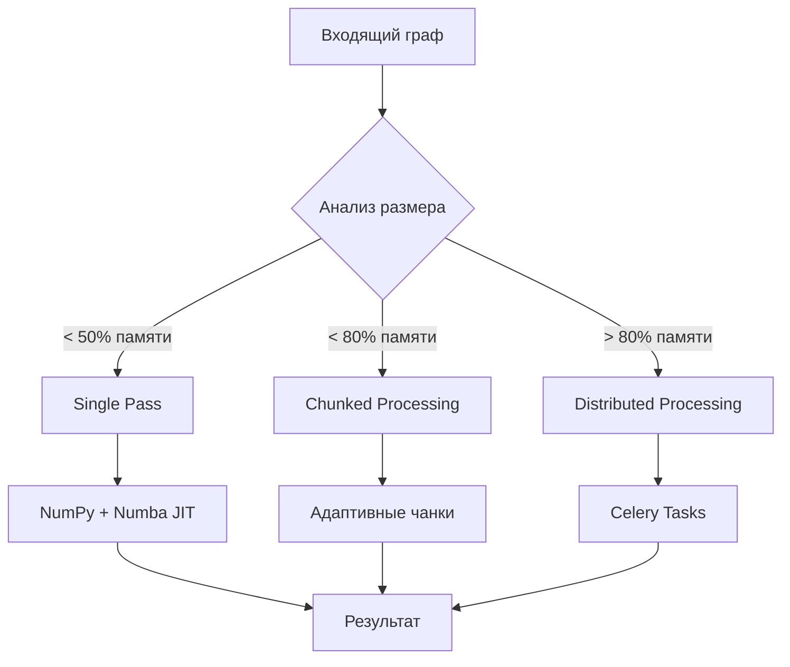

# 🚀 Распределённый воркер для укладки больших графов

Высокопроизводительное решение для обработки графов карты знаний размером до **30M узлов** и **80M связей** с оригинальным объёмом данных **50GB**.

## 🎯 Ключевые возможности

- **Адаптивная обработка**: Автоматический выбор стратегии на основе размера данных и доступных ресурсов
- **Высокая производительность**: NumPy + Numba JIT + Cython оптимизации  
- **Гибридная архитектура**: Предварительная обработка в Neo4j + Python алгоритмы
- **Отказоустойчивость**: Circuit Breaker, retry механизмы, graceful degradation
- **Мониторинг**: Prometheus метрики + Grafana дашборды
- **Горизонтальное масштабирование**: Celery воркеры + Redis

### 🔄 Трёхуровневая стратегия обработки



### 🧠 Компоненты системы

| Компонент | Назначение | Технологии |
|-----------|------------|------------|
| **Neo4j Procedures** | Предварительная обработка в БД | Cypher, APOC |
| **High-Performance Algorithm** | Оптимизированные вычисления | NumPy, Numba JIT |
| **Distributed Manager** | Оркестрация задач | Celery, Redis |
| **Memory Manager** | Контроль ресурсов | psutil, адаптивные алгоритмы |
| **Circuit Breaker** | Отказоустойчивость | Паттерн Circuit Breaker |
| **Metrics System** | Мониторинг | Prometheus, Grafana |

## ⚡ Производительность и оптимизации

### Ключевые оптимизации:
1. **Neo4j процедуры** - максимальная работа в базе данных
2. **NumPy массивы** - векторизованные операции
3. **Numba JIT** - компиляция критических участков  
4. **Потоковая загрузка** - минимальное потребление памяти
5. **Адаптивные чанки** - динамический размер на основе ресурсов
6. **Connection pooling** - эффективное использование соединений

## 🚀 Быстрый старт

### Предварительные требования
- Docker и Docker Compose
- Neo4j с APOC и GDS плагинами
- Минимум 16GB RAM для больших графов

### 1. Установка Neo4j процедур (PowerShell)
```powershell
# Запускаем скрипт установки процедур
.\worker_distributed_layering\scripts\install_neo4j_procedures.ps1

# Или с принудительной переустановкой
.\worker_distributed_layering\scripts\install_neo4j_procedures.ps1 -Force

# Проверка установленных процедур
.\worker_distributed_layering\scripts\install_neo4j_procedures.ps1 -Verify
```

### 2. Запуск распределённой системы (PowerShell)
```powershell
# Запуск в режиме разработки (минимальная конфигурация)
.\worker_distributed_layering\scripts\start_layout_worker.ps1 -Mode dev

# Запуск в продакшн режиме (полная конфигурация)
.\worker_distributed_layering\scripts\start_layout_worker.ps1 -Mode production

# Запуск с мониторингом (включает Flower UI)
.\worker_distributed_layering\scripts\start_layout_worker.ps1 -Mode monitoring

# Пересборка образов и запуск с логами
.\worker_distributed_layering\scripts\start_layout_worker.ps1 -Mode dev -Build -Logs
```

### 3. Тестирование системы (PowerShell)
```powershell
# Проверка здоровья всех сервисов
.\worker_distributed_layering\scripts\test_layout_worker.ps1 -TestType health

# Небольшой тест (100 узлов)
.\worker_distributed_layering\scripts\test_layout_worker.ps1 -TestType small

# Средний тест (1000 узлов)
.\worker_distributed_layering\scripts\test_layout_worker.ps1 -TestType medium

# Большой тест (10000 узлов) - может занять несколько минут
.\worker_distributed_layering\scripts\test_layout_worker.ps1 -TestType large

# Кастомный тест с указанным количеством узлов
.\worker_distributed_layering\scripts\test_layout_worker.ps1 -TestType custom -NodeCount 5000 -Verbose
```

### 4. Мониторинг
- **Метрики воркера**: http://localhost:9100/metrics
- **Flower (Celery UI)**: http://localhost:5555 (только в режиме monitoring)
- **Neo4j Browser**: http://localhost:7474

### 5. Запуск укладки через PowerShell
```powershell
# Прямое выполнение через Docker
docker exec knowledge_map_layout_manager python main.py single --node-labels Block --options '{"optimize_layout": true}'

# Проверка здоровья
docker exec knowledge_map_layout_manager python main.py health

# Просмотр логов
docker-compose logs -f layout_worker_manager
```

## 📊 Режимы работы

### Single Pass (< 1M узлов)
- Загрузка всего графа в память
- Максимальная производительность
- Использует NumPy + Numba JIT

### Chunked Processing (1M - 10M узлов)  
- Адаптивное разбиение на чанки
- Баланс производительности и памяти
- Автоматическое определение размера чанка

### Distributed Processing (> 10M узлов)
- Celery задачи для каждой компоненты
- Горизонтальное масштабирование
- Neo4j процедуры для разбиения графа

## ⚙️ Конфигурация

### Переменные окружения (оптимизированы для вашего железа)
```bash
# Neo4j подключение
NEO4J_URI=bolt://neo4j:7687
NEO4J_USER=neo4j
NEO4J_PASSWORD=password

# Redis/Celery (разные базы данных для изоляции)
REDIS_URL=redis://redis:6379/3
CELERY_BROKER_URL=redis://redis:6379/4
CELERY_RESULT_BACKEND=redis://redis:6379/5

# Производительность (адаптировано под i7 8th Gen + 16GB RAM)
CHUNK_SIZE=5000          # Уменьшено для экономии памяти
MEMORY_LIMIT_GB=4.0      # Консервативный лимит
MAX_WORKERS=2            # Оптимально для i7 8-го поколения
ENABLE_NUMBA_JIT=true    # Ускорение вычислений
NUMBA_NUM_THREADS=4      # Использование всех ядер

# Мониторинг
LOG_LEVEL=INFO
PROMETHEUS_PORT=9100     # Изменён чтобы не конфликтовать с API
```

## 🔧 Структура проекта

```
worker_distributed_layering/
├── src/
│   ├── algorithms/
│   │   ├── distributed_layout.py    # Основной алгоритм
│   │   ├── optimized_layout.py      # Высокопроизводительная версия
│   │   └── neo4j_layout.py          # Интеграция с Neo4j
│   ├── utils/
│   │   ├── memory_manager.py        # Управление памятью
│   │   ├── metrics.py              # Prometheus метрики
│   │   └── circuit_breaker.py      # Отказоустойчивость
│   ├── config.py                   # Конфигурация
│   ├── neo4j_client.py            # Neo4j клиент
│   └── tasks.py                   # Celery задачи
├── cypher_procedures/             # Neo4j процедуры
├── monitoring/                    # Конфигурация мониторинга
└── main.py                       # Точка входа
```

## Этапы обработки

### Этап 1: Предварительная обработка в Neo4j
1. Фильтрация узлов по критериям
2. Выявление компонент связности
3. Топологическая сортировка
4. Вычисление базовых метрик

### Этап 2: Распределённая обработка в Python
1. Разбиение графа на подграфы
2. Параллельная обработка подграфов
3. Оптимизация укладки
4. Сборка результатов

### Этап 3: Сохранение результатов
1. Обновление координат в Neo4j
2. Кэширование в Redis
3. Уведомления клиентов

## Масштабируемость

- **Вертикальное масштабирование**: Увеличение ресурсов воркеров
- **Горизонтальное масштабирование**: Добавление новых воркеров
- **Адаптивное разбиение**: Динамическое изменение размера чанков

## Мониторинг и отказоустойчивость

- **Health checks** для всех компонентов
- **Retry механизмы** для неудачных задач
- **Circuit breaker** для защиты от каскадных отказов
- **Метрики производительности** в реальном времени
